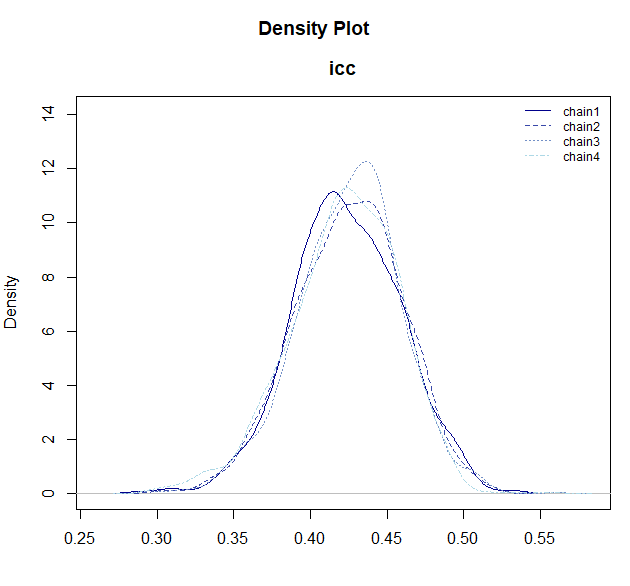

# BayesRTMB の概要

## BayesRTMB とは？

**BayesRTMB** は、RTMB を自動微分エンジンとして用いる ベイズ推定用のR
パッケージです。 Stan に近い感覚でモデルを書きつつ、R
の中でC++へのコンパイルなしにそのままベイズ推定を進められます。

このページでは、BayesRTMB
の位置づけと、パッケージを使う上での全体像をまとめます。

### 記事へのリンク

以下のような記事があります。

- **[日本語トップ](https://norimune.github.io/BayesRTMB/articles/ja-introduction.md)**
- **[クイックスタート](https://norimune.github.io/BayesRTMB/articles/ja-quick_start.md)**
- **[ラッパー関数の使い方](https://norimune.github.io/BayesRTMB/articles/ja-wrapper_functions.md)**
- **[コードの書き方](https://norimune.github.io/BayesRTMB/articles/ja-writing_models.md)**
- **[RTMBの仕組みと推定のアルゴリズム](https://norimune.github.io/BayesRTMB/articles/ja-rtmb_internals.md)**

### BayesRTMB でできること

BayesRTMB には、次のような特徴があります。

- **C++ のコンパイルなしでモデルを書ける**
- **[`rtmb_code()`](https://norimune.github.io/BayesRTMB/reference/rtmb_code.md)
  によるブロック構文**でモデルを整理して書ける
- **NUTS / ADVI / MAP** を同じモデルオブジェクトから使い分けられる
- **Laplace 近似**により、階層モデルの random effect を効率よく扱える
- **Bridge Sampling** を使った周辺尤度や Bayes factor
  の計算に対応している
- **[`rtmb_lm()`](https://norimune.github.io/BayesRTMB/reference/rtmb_lm.md)
  や
  [`rtmb_glmer()`](https://norimune.github.io/BayesRTMB/reference/rtmb_glmer.md)
  などのラッパー関数**で、標準的な分析をすぐに始められる

### インストール方法

GitHubから開発版をインストールできます。

``` r

# install.packages("remotes")
remotes::install_github("norimune/BayesRTMB")
```

#### Windows ユーザーへの重要なお知らせ

BayesRTMB は裏側の計算エンジンとして `RTMB` や `TMB`
を使用しており、これらは C++
のライブラリに依存しています。そのため、Windows
環境でパッケージをインストールするには、C++
のコードをコンパイルするためのツールである **Rtools
のインストールが必須** となります。

1.  ご自身の R のバージョンに合った
    [Rtools](https://cran.r-project.org/bin/windows/Rtools/)
    をダウンロードしてインストールしてください（例: R 4.4.x
    をお使いの場合は Rtools44）。
2.  インストール完了後、RStudio を再起動します。
3.  以下のコードを実行し、Rtools
    がシステムに正しく認識されているかを確認できます。

``` r

# 実行結果として TRUE が返ってくれば、コンパイル環境の構築は成功です。
pkgbuild::check_build_tools(debug = TRUE)
```

### 基本の流れ

BayesRTMB の基本的な分析は、次の 3 段階で進みます。

1.  **データ**を用意する
2.  **[`rtmb_code()`](https://norimune.github.io/BayesRTMB/reference/rtmb_code.md)**
    でモデルを書く
3.  **[`rtmb_model()`](https://norimune.github.io/BayesRTMB/reference/RTMB_Model.md)**
    でモデルオブジェクトを作り、推定する

例として、平均 `mu` と標準偏差 `sigma`
を推定する単純な正規分布モデルをとりあげます。

``` r

# 1. データの準備
Y <- c(5.2, 4.8, 5.5, 6.1, 4.9, 5.3)
dat <- list(Y = Y)

# 2. モデルの定義
code <- rtmb_code(
  parameters = {
    mu    = Dim(1)
    sigma = Dim(1, lower = 0)
  },
  model = {
    mu    ~ normal(0, 10)
    sigma ~ exponential(0.1)
    Y     ~ normal(mu, sigma)
  }
)

# 3. モデルオブジェクトの作成
mdl <- rtmb_model(data = dat, code = code)
```

### 推定法の使い分け

作成した 1 つの `mdl`
オブジェクトに対して、目的に応じて複数の推定メソッドを呼び出すことができます。

#### 1. MAP 推定 (`optimize`)

事後分布を最大化する点（事後最頻値）を求めます。計算が非常に速いため、モデルの記述にエラーがないか、大まかな結果がどうなるかを素早く確認したいときに最適です。

``` r

opt_fit <- mdl$optimize()
opt_fit$summary()
```

``` text
## Call:
## MAP Estimation via RTMB
## 
## Negative Log-Posterior: 9.13
## Approx. Log Marginal Likelihood (Laplace): -11.14
## 
## Point Estimates and 95% Wald CI:
## variable  Estimate  Std. Error  Lower 95%  Upper 95% 
## mu         5.29839     0.17416    4.95704    5.63974 
## sigma      0.42624     0.12240    0.24279    0.74830 
```

#### 2. MCMC 推定 (`sample`)

NUTS (No-U-Turn Sampler)
アルゴリズムを用いて、事後分布全体から正確なサンプルを抽出する最も標準的なベイズ推論のアプローチです。`parallel = TRUE`
を指定すると複数チェーンの並列計算が可能です（デフォルトは `FALSE`）。

``` r

mcmc_fit <-
  mdl$sample(
    sampling = 1000,
    warmup = 1000,
    chains = 4,
    parallel = FALSE
  )
mcmc_fit$summary()
```

``` text
## variable    mean    sd     map    q2.5  q97.5  ess_bulk  ess_tail  rhat 
## lp        -11.15  1.24  -10.19  -14.63  -9.97       923       830  1.01 
## mu          5.29  0.30    5.32    4.68   5.87      1122       495  1.00 
## sigma       0.65  0.31    0.48    0.32   1.41      1072      1404  1.00
```

#### 3. 変分推論 (`variational`)

ADVI (自動微分変分ベイズ) を用いて、近似的に事後分布を求めます。MCMC
では時間がかかりすぎる複雑なモデルを高速に推定したい場合に向いています。ただし、事後分布の不確実性（標準誤差など）は過小評価されやすいため、主に点推定値や大まかな分布の形状を素早く得たい用途に適しています。

``` r

vb_fit <- mdl$variational(
  method = "meanfield",
  iter = 3000,
  num_estimate = 4
)
vb_fit$summary()
```

``` text
## variable    mean    sd     map    q2.5   q97.5 
## lp        -12.85  2.08  -12.33  -17.10  -10.21 
## mu          5.31  0.39    5.32    4.54    6.07 
## sigma       1.12  0.57    0.86    0.40    2.63 
```

### ランダム効果 (Random effect) を含むモデル

階層モデルなどを構築する場合、パラメータを `random = TRUE`
として宣言できます。

``` r

data(discussion)

Y <- discussion$satisfaction
group <- discussion$group
G <- length(unique(group))

data_icc <- list(Y = Y,group = group, G = G)

code_icc <- rtmb_code(
  parameters = {
    mu    <- Dim()
    sigma <- Dim(lower = 0)
    tau   <- Dim(lower=0)
    r     <- Dim(G, random = TRUE)
  },
  model = {
    Y ~ normal(mu + r[group] * tau, sigma)
    r ~ normal(0, 1)
    tau ~ exponential(1)
    sigma   ~ exponential(1)
  },
  generate = {
    icc = tau / (tau + sigma)
  }
)
```

このようなモデルでは、Laplace
近似を使ってランダム効果を周辺化（積分消去）できます。MAP 推定
([`optimize()`](https://rdrr.io/r/stats/optimize.html)) ではデフォルトで
`laplace = TRUE` となり、自動的に適用されます。
生成量の信頼区間は、`se_sampling=TRUE`とすることで計算できます。

``` r

mdl_icc <- rtmb_model(data_icc, code_icc)


opt_icc <- mdl_icc$optimize(laplace = TRUE, se_sampling = TRUE)
opt_icc
```

``` text
## Call:
## MAP Estimation via RTMB
## 
## Negative Log-Posterior: 407.96
## Approx. Log Marginal Likelihood (Laplace): -413.73
## Note: Random effects are stored in $random_effects
## 
## Point Estimates and 95% Wald CI:
## variable  Estimate  Std. Error  Lower 95%  Upper 95% 
## mu         3.43333     0.07387    3.28647    3.58483 
## sigma      0.79705     0.04187    0.72217    0.88498 
## tau        0.58599     0.06962    0.46731    0.73489 
## icc        0.42370     0.03414    0.35876    0.49122 
```

MCMC ([`sample()`](https://rdrr.io/r/base/sample.html))
でも指定は可能ですが、MCMCの場合は変量効果が問題なく推定できるため、基本的にはデフォルトの
`laplace = FALSE` で問題ありません。

``` r

mcmc_icc <- mdl_icc$sample()

# plot_dens()で事後分布を描画できる
mcmc_icc$draws("icc") |> plot_dens()
```



### ラッパー関数で簡単に分析する

BayesRTMB
には、標準的な分析を一からモデル定義しなくても簡単に実行できるラッパー関数が用意されています。

たとえば線形回帰であれば
[`rtmb_lm()`](https://norimune.github.io/BayesRTMB/reference/rtmb_lm.md)
を使います。

``` r

data(discussion)
fit_lm <- rtmb_lm(satisfaction ~ talk + skill, data = discussion)

# MAP推定
map_lm <- fit_lm$optimize()
map_lm$summary()
```

``` text
## Call:
## MAP Estimation via RTMB
## 
## Negative Log-Posterior: 416.94
## Approx. Log Marginal Likelihood (Laplace): -425.12
## 
## Point Estimates and 95% Wald CI:
##    variable  Estimate  Std. Error  Lower 95%  Upper 95% 
## Intercept     2.14693     0.20761    1.74001    2.55384 
## b[talk]       0.28612     0.05434    0.17961    0.39264 
## b[skill]      0.20106     0.06604    0.07162    0.33050 
## sigma         0.92284     0.03725    0.85265    0.99880 
## Intercept_c   3.43324     0.05333    3.32871    3.53777 
```

一般化線形混合モデルには
[`rtmb_glmer()`](https://norimune.github.io/BayesRTMB/reference/rtmb_glmer.md)、因子分析には
[`rtmb_fa()`](https://norimune.github.io/BayesRTMB/reference/rtmb_fa.md)
など、分析目的に応じた関数が利用できます。

また、[`rtmb_ttest()`](https://norimune.github.io/BayesRTMB/reference/rtmb_ttest.md)
を使うと、ベイジアン t
検定が簡単に実行できます。[`bayes_factor()`](https://norimune.github.io/BayesRTMB/reference/bayes_factor.md)
メソッドで `null_model` 引数に「0
に固定したいパラメータ名」を指定するだけで、自動的に比較モデルの推定とベイズファクターの計算が行われます。

``` r

data(discussion)
mdl_ttest <- rtmb_ttest(satisfaction ~ condition, data = discussion, r = 0.707)
mcmc_ttest <- mdl_ttest$sample()

# 効果量(delta)を0に固定した帰無モデルとの比較
bf_ttest <- mcmc_ttest$bayes_factor(null_model = "delta")
bf_ttest
```

``` text
## Bayes Factor (BF12) : 21.51 
## Log Bayes Factor    : 3.0685 (Approx. Error = 0.0021)
## Interpretation      : Strong evidence for Model 1 
```

### 次のステップ

BayesRTMB
の全体像がつかめたら、以下の順番でドキュメントを参照して具体的な使い方を深めていくことをおすすめします。

1.  **[クイックスタート](https://norimune.github.io/BayesRTMB/articles/ja-quick_start.md)**
    二項モデル、回帰モデル、階層モデル、GLMM、混合分布モデルなどの
    具体例を通して、`setup` や `transform`
    などの各ブロックの役割と、実践的な分析方法を学びます。
2.  **[コードの書き方](https://norimune.github.io/BayesRTMB/articles/ja-writing_models.md)**
    各関数の詳細な仕様を確認できます。 3.**その他リファレンス**
    特に自分でモデルを構築する際は、以下のページが役立ちます。
    - [`rtmb_code()`](https://norimune.github.io/BayesRTMB/reference/rtmb_code.md):
      各ブロックの記述ルールと仕様
    - [`Dim()`](https://norimune.github.io/BayesRTMB/reference/Dim.md):
      パラメータの型と制約（`parameter_types`）
    - `distributions` / `math_functions`:
      組み込みの確率分布や、数値計算を安定させる数学関数
