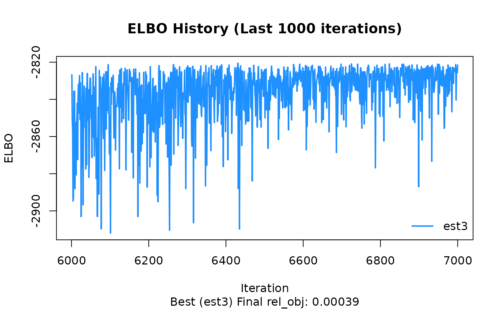

# BayesRTMB 日本語クイックスタート

このページでは、**BayesRTMB
を実際に使い始めるための最短ルート**を順を追って説明します。

1.  **二項モデル**:
    [`rtmb_code()`](https://norimune.github.io/BayesRTMB/reference/rtmb_code.md)
    と
    [`rtmb_model()`](https://norimune.github.io/BayesRTMB/reference/RTMB_Model.md)
    の最小構成の流れを確認します。
2.  **回帰モデル**: モデル定義内の各ブロック (`setup`, `transform` など)
    の役割を確認します。
3.  **階層モデル**: ランダム効果 (random effect) と Laplace
    近似の実践的な使い方を確認します。

------------------------------------------------------------------------

## 1. Binomial model (二項モデル)

最初に、もっとも単純な二項モデルを例に、基本的な流れを確認します。10
回の試行のうち、成功が 6 回観測された状況を扱います。

``` r
library(BayesRTMB)
```

    ## Loading required package: RTMB

``` r
Trial <- 10
Y <- 6
data_list <- list(Trial = Trial, Y = Y)

model_code <- rtmb_code(
  parameters = {
    theta = Dim(lower = 0, upper = 1) # 確率は0~1の範囲に制約
  },
  model = {
    # 尤度
    Y ~ binomial(Trial, theta)
    # 事前分布
    theta ~ beta(2, 2)
  }
)
```

### モデルオブジェクトの作成 (`rtmb_model`)

[`rtmb_model()`](https://norimune.github.io/BayesRTMB/reference/RTMB_Model.md)
は、観測データ `data` とモデル定義 `code`
を結びつけ、**推定用のモデルオブジェクト**を作ります。この段階ではまだ推定は行われません。

``` r
mdl <- rtmb_model(data = data_list, code = model_code)
```

    ## Pre-checking model code...
    ## Checking RTMB setup...

### MAP推定 (`optimize`)

事後分布の最頻値に対応する**点推定**を求めたいときは
[`optimize()`](https://rdrr.io/r/stats/optimize.html) を使います。

``` r
fit_MAP <- mdl$optimize()
```

    ## Starting optimization...
    ## 
    ## Optimization converged. Final objective: 1.01

``` r
fit_MAP
```

    ## 
    ## Call:
    ## MAP Estimation via RTMB
    ## 
    ## Negative Log-Posterior: 1.01
    ## Approx. Log Marginal Likelihood (Laplace): -0.63
    ## 
    ## Point Estimates and 95% Wald CI:
    ## variable  Estimate  Std. Error  Lower 95%  Upper 95% 
    ## theta      0.58309     0.14234    0.30743    0.81504

#### 標準誤差と区間推定 (`se_sampling`)

`se_sampling = TRUE`
を指定すると、自動微分で計算されたパラメータの共分散行列をもとにシミュレーションを行い、パラメータや派生量の**標準誤差と
95% 信頼区間**を計算してくれます。

``` r
fit_MAP <- mdl$optimize(se_sampling = TRUE)
```

    ## Starting optimization...
    ## 
    ## Optimization converged. Final objective: 1.01
    ## Using simulation-based error propagation (1000 samples)...

``` r
fit_MAP
```

    ## 
    ## Call:
    ## MAP Estimation via RTMB
    ## 
    ## Negative Log-Posterior: 1.01
    ## Approx. Log Marginal Likelihood (Laplace): -0.63
    ## 
    ## Point Estimates and 95% Wald CI:
    ## variable  Estimate  Std. Error  Lower 95%  Upper 95% 
    ## theta      0.58309     0.13505    0.30462    0.81333

### MCMC推定 (`sample`)

NUTS (No-U-Turn Sampler) を用いた MCMC
サンプリングを行います。事後分布全体の形状や不確実性を正確に評価したい場合の標準的な手法です。

``` r
fit_mcmc <- mdl$sample(sampling = 1000, warmup = 1000, chains = 4, thin = 1)
```

``` r
fit_mcmc
```

    ## variable   mean    sd    map   q2.5  q97.5  ess_bulk  ess_tail  rhat 
    ## lp        -2.96  0.74  -2.48  -5.00  -2.42      1846      2152  1.00 
    ## theta      0.58  0.13   0.58   0.31   0.81      1170      1901  1.00

#### 周辺尤度の計算 (`bridgesampling`)

`bridgesampling()` メソッドを呼ぶと、得られた MCMC
サンプルをもとに**対数周辺尤度 (log_ml)**
を推定します。一度計算された結果はオブジェクトに保存され、モデル比較に利用できます。

``` r
fit_mcmc$bridgesampling()
```

    ## Bridge Sampling Converged: LogML = -2.102 (Error = 0.0012, ESS = 1354.1)

    ## [1] -2.101626
    ## attr(,"error")
    ## [1] 0.001203673
    ## attr(,"ess")
    ## [1] 1354.054

``` r
fit_mcmc$log_ml
```

    ## [1] -2.101626
    ## attr(,"error")
    ## [1] 0.001203673
    ## attr(,"ess")
    ## [1] 1354.054

### 変分推論 (`variational`)

自動微分変分ベイズ法 (ADVI) による**近似推定**を行います。MCMC
より高速に結果の概形をつかみたいときに便利です。

``` r
fit_vb$plot_elbo()
```


``` r
fit_vb
```

    ## variable   mean    sd    map   q2.5  q97.5 
    ## lp        -2.95  0.74  -2.49  -5.18  -2.42 
    ## theta      0.58  0.13   0.61   0.32   0.82

------------------------------------------------------------------------

## 2. Regression model (回帰モデル)

次に、単回帰分析を例に
[`rtmb_code()`](https://norimune.github.io/BayesRTMB/reference/rtmb_code.md)
の **各ブロックの役割** を確認します。

- **`setup`**:
  データの次元整理や定数の計算を行います（ここは自動微分されず、1回だけ実行されます）。
- **`parameters`**: 推定するパラメータを宣言します。
- **`transform`**: パラメータから構成される派生量（ここでは線形予測子
  `mu`）を定義します。
- **`model`**: 尤度関数と事前分布を定義します。

``` r
set.seed(123)
alpha <- 5
beta <- c(1)
sigma <- 2
N <- 50
X <- matrix(seq(1, 5, length.out = N), ncol = 1)
Y <- alpha + X[, 1] * beta + rnorm(N, 0, sigma)

data_reg <- list(Y = Y, X = X)

code_reg <- rtmb_code(
  setup = {
    N <- length(Y)
    P <- ncol(X)
  },
  parameters = {
    alpha = Dim()
    beta  = Dim(P)
    sigma = Dim(lower = 0)
  },
  transform = {
    # 行列演算を用いた線形予測子の計算
    mu = alpha + as.vector(X %*% beta)
  },
  model = {
    Y ~ normal(mu, sigma)
    alpha ~ normal(0, 100)
    beta  ~ normal(0, 10)
    sigma ~ exponential(1/10)
  }
)
```

#### 初期値の指定と表示の制御

[`rtmb_model()`](https://norimune.github.io/BayesRTMB/reference/RTMB_Model.md)
では `init` で初期値を与えたり、`view` で
[`summary()`](https://rdrr.io/r/base/summary.html)
時の優先表示順を指定したりできます。初期値を明示しておくと、複雑なモデルで推定が安定しやすくなります。

``` r
mdl_reg <- rtmb_model(
  data = data_reg, 
  code = code_reg, 
  init = list(alpha = 0, beta = 0),
  view = c("alpha", "beta", "sigma")
)
```

    ## Pre-checking model code...
    ## Checking RTMB setup...

``` r
opt_reg <- mdl_reg$optimize(se_sampling = TRUE)
```

    ## Starting optimization...
    ## 
    ## Optimization converged. Final objective: 112.47
    ## Using simulation-based error propagation (1000 samples)...

``` r
opt_reg$summary()
```

    ## 
    ## Call:
    ## MAP Estimation via RTMB
    ## 
    ## Negative Log-Posterior: 112.47
    ## Approx. Log Marginal Likelihood (Laplace): -114.89
    ## 
    ## Point Estimates and 95% Wald CI:
    ## variable  Estimate  Std. Error  Lower 95%  Upper 95% 
    ## alpha      5.16974     0.70841    3.83342    6.59727 
    ## beta       0.96635     0.21849    0.53493    1.39906 
    ## sigma      1.82755     0.18022    1.50302    2.20726 
    ## mu[1]      6.13609     0.51081    5.18426    7.17728 
    ## mu[2]      6.21498     0.49545    5.29736    7.23522 
    ## mu[3]      6.29386     0.48027    5.40404    7.27574 
    ## mu[4]      6.37275     0.46527    5.50768    7.33337 
    ## mu[5]      6.45163     0.45049    5.61612    7.38735 
    ## mu[6]      6.53052     0.43592    5.71593    7.42122 
    ## mu[7]      6.60941     0.42162    5.81563    7.46393

#### ベイズファクターによる変数評価 (`bayes_factor`)

MCMC 実行後、特定の係数が 0
であるという仮説（帰無モデル）との間でベイズファクターを計算できます。以下の例では、`beta`
を 0 に固定したモデルとフルモデルを比較します。

``` r
mcmc_reg <- mdl_reg$sample()
bf_result <- mcmc_reg$bayes_factor(null_model = "beta")
```

``` r
bf_result
```

    ## Bayes Factor (BF12) : 59.1088 
    ## Log Bayes Factor    : 4.0794 (Approx. Error = 0.0055)
    ## Interpretation      : Strong evidence for Model 1

------------------------------------------------------------------------

## 3. Hierarchical model (階層モデル)

最後に、個体ごとのランダム効果 (random effect)
を含む階層モデルを作成します。R に組み込みの `ChickWeight`
データを用います。

パラメータ宣言時に `random = TRUE`
を指定することで、その変数はランダム効果として扱われます。

``` r
Y <- ChickWeight$weight
X <- model.matrix(weight ~ Time + Diet, data = ChickWeight)[, -1]
ID <- as.integer(as.factor(ChickWeight$Chick)) # インデックス化

data_hlm <- list(Y = Y, X = X, ID = ID)

code_hlm <- rtmb_code(
  setup = {
    N <- length(Y)
    G <- length(unique(ID))
    P <- ncol(X)
  },
  parameters = {
    alpha = Dim()
    beta  = Dim(P)
    tau   = Dim(lower = 0)
    sigma = Dim(lower = 0)
    r     = Dim(G, random = TRUE) # ランダム効果として宣言
  },
  transform = {
    mu = alpha + as.vector(X %*% beta) + r[ID] * tau
  },
  model = {
    Y ~ normal(mu, sigma)
    r ~ normal(0, 1)      # 個体差の事前分布（標準正規分布）
    alpha ~ normal(0, 100)
    beta  ~ normal(0, 10)
    tau   ~ exponential(1/10)
    sigma ~ exponential(1/10)
  }
)

mdl_hlm <- rtmb_model(
  data = data_hlm,
  code = code_hlm,
  par_names = list(beta = c("Time", "Diet2", "Diet3", "Diet4")),
  view = c("alpha", "beta", "tau", "sigma")
)
```

    ## Pre-checking model code...
    ## Checking RTMB setup...

### Laplace 近似を用いた MAP 推定

階層モデルで `optimize(laplace = TRUE)` を指定すると、TMB
の強力な機能である **Laplace 近似**
を用いてランダム効果を積分消去しながら固定効果を推定します。これにより計算が劇的に高速化・安定化します。

``` r
opt_hlm <- mdl_hlm$optimize(num_estimate = 4, laplace = TRUE)
```

    ## Starting optimization...
    ## Optimization run 1/4...Optimization run 2/4...Optimization run 3/4...Optimization run 4/4...
    ## 
    ## Optimization Diagnostics per estimate:
    ##   est1: Objective =    2925.70, Code = 0 (Converged)
    ##   est2: Objective =    2836.45, Code = 0 (Converged)
    ##   est3: Objective =    2925.70, Code = 0 (Converged)
    ##   est4: Objective =    2836.45, Code = 0 (Converged)  <-- BEST

``` r
opt_hlm$summary()
```

    ## 
    ## Call:
    ## MAP Estimation via RTMB
    ## 
    ## Negative Log-Posterior: 2836.45
    ## Approx. Log Marginal Likelihood (Laplace): -2830.53
    ## Note: Random effects are stored in $random_effects
    ## 
    ## Point Estimates and 95% Wald CI:
    ##    variable  Estimate  Std. Error  Lower 95%  Upper 95% 
    ## alpha        21.13542     4.80045   11.72671   30.54413 
    ## beta[Time]    8.72261     0.17479    8.38002    9.06520 
    ## beta[Diet2]   3.94823     6.71961   -9.22198   17.11843 
    ## beta[Diet3]  16.77738     6.90118    3.25132   30.30345 
    ## beta[Diet4]  12.65242     6.83185   -0.73775   26.04260 
    ## tau          22.77557     2.61452   18.18679   28.52216 
    ## sigma        28.14964     0.86276   26.50846   29.89242 
    ## mu[1]        16.97452     9.81426   -2.26107   36.21011 
    ## mu[2]        34.41974     9.75568   15.29897   53.54051 
    ## mu[3]        51.86496     9.70933   32.83502   70.89491

### MCMC

階層モデルでも [`sample()`](https://rdrr.io/r/base/sample.html)
によってMCMC推定を行えます。
チェイン数が多い場合やモデルが重い場合は、`parallel = TRUE`
を指定して並列計算することもできます(下ではFALSEにしています)。1回目は並列化のためのワーカー立ち上げに時間がかかりますが、2回目以降は高速に立ち上がります。
収束診断を確認しながら、必要なら `warmup` や `sampling`
を増やしていきます。

``` r
mcmc_hlm <- mdl_hlm$sample(sampling = 2000,
                           warmup = 2000,
                           parallel = TRUE)
```

``` r
mcmc_hlm$summary()
```

    ##    variable      mean    sd       map      q2.5     q97.5  ess_bulk  ess_tail  rhat 
    ## lp           -2849.01  7.51  -2848.49  -2864.90  -2835.46       757      2262  1.01 
    ## alpha           21.39  5.03     21.55     11.66     31.51       526      1464  1.01 
    ## beta[Time]       8.73  0.17      8.70      8.38      9.06      2042      3682  1.00 
    ## beta[Diet2]      3.78  7.07      4.85    -10.34     17.67       820      1619  1.01 
    ## beta[Diet3]     15.64  7.24     15.36      1.50     29.68       704      2236  1.01 
    ## beta[Diet4]     12.18  7.12     12.06     -2.07     25.90       869      1963  1.00 
    ## tau             24.15  2.87     22.94     19.12     30.53       550      1261  1.02 
    ## sigma           28.25  0.87     28.25     26.57     29.97      2076      2972  1.00 
    ## r[1]             0.18  0.66      0.23     -1.11      1.50      1939      3203  1.00 
    ## r[2]            -0.83  0.44     -0.77     -1.72      0.02      1462      2541  1.00

MCMCでもlaplace近似を実行できます。推定結果は変わりませんが、MCMCの自己相関は下がりやすいので、収束は安定します。ただ、推定時間は長くなるので、一長一短です。MCMCで十分収束するなら、laplace近似を特別使う必要はないかも知れません。
ただ、WAICなどの予測指標を使うとき、階層化するときとしないときの比較が難しいので、laplace近似が自動でできると便利なときもあります。

``` r
mcmc_hlm <- mdl_hlm$sample(sampling = 1000,
                           warmup = 1000,
                           parallel = FALSE,
                           laplace = TRUE)
```

``` r
mcmc_hlm$summary()
```

    ##    variable      mean    sd       map      q2.5     q97.5  ess_bulk  ess_tail  rhat 
    ## lp           -2833.44  1.87  -2832.85  -2838.01  -2830.83      1490      2830  1.00 
    ## alpha           21.64  4.94     21.89     12.30     32.05      2247      2813  1.00 
    ## beta[Time]       8.72  0.18      8.69      8.38      9.08      3286      2872  1.00 
    ## beta[Diet2]      3.59  6.57      3.10     -9.75     15.90      3192      2486  1.00 
    ## beta[Diet3]     15.87  7.06     16.46      1.45     29.08      2911      2825  1.00 
    ## beta[Diet4]     11.85  6.86     10.74     -1.85     25.05      2823      2349  1.00 
    ## tau             24.10  2.80     22.81     19.32     30.29      3174      2904  1.00 
    ## sigma           28.28  0.87     28.24     26.67     30.06      3385      2570  1.00 
    ## mu[1]           16.99  1.97     17.34     12.99     20.82      2794      2832  1.00 
    ## mu[2]           34.43  1.63     34.73     31.13     37.61      2714      2658  1.00

### 変分推論 (ADVI)

階層モデルは MCMC だと時間がかかることがありますが、ADVI
を使うと近似的に素早く分布を得られます。局所解に陥るのを防ぐため、`parallel = TRUE`
と初期値の指定を組み合わせて複数回推定を行うのが安全です（下では直列にしています）。

``` r
# lme4 を使って初期値を大まかに設定
result_lmer <- lme4::lmer(weight ~ Time + Diet + (1|Chick), data = ChickWeight)

vb_hlm <- mdl_hlm$variational(
  iter = 7000,
  parallel = FALSE,
  init = list(alpha = result_lmer@beta[1], beta = result_lmer@beta[-1]),
  method = "fullrank", # 事後分布の相関も考慮
  laplace = TRUE
)
```

ADVI
は近似手法であるため、ELBO（変分下界）が適切に収束しているかの確認が必須です。`ests = "best"`
を指定することで、複数回実行したうち最も ELBO
が高かった結果の推移を確認できます。

``` r
vb_hlm$plot_elbo(ests = "best")
```



``` r
vb_hlm$summary()
```

    ##    variable      mean    sd       map      q2.5     q97.5 
    ## lp           -2838.78  7.55  -2833.96  -2859.21  -2831.44 
    ## alpha           20.62  5.03     21.10     11.05     30.29 
    ## beta[Time]       8.72  0.14      8.69      8.46      8.98 
    ## beta[Diet2]      4.74  6.85      3.91     -8.79     18.01 
    ## beta[Diet3]     16.74  7.03     17.22      2.60     30.40 
    ## beta[Diet4]     13.27  6.91     14.00      0.15     26.15 
    ## tau             24.44  2.76     24.62     19.24     30.29 
    ## sigma           26.32  1.83     25.73     22.99     30.06 
    ## mu[1]           16.85  1.58     16.60     13.78     19.87 
    ## mu[2]           34.28  1.32     34.07     31.74     36.80

## まとめ

このページでは、BayesRTMB の基本的な流れを 3 つのモデルで確認しました。

- **単純なモデル**では、[`rtmb_code()`](https://norimune.github.io/BayesRTMB/reference/rtmb_code.md)
  と
  [`rtmb_model()`](https://norimune.github.io/BayesRTMB/reference/RTMB_Model.md)
  の最小構成を確認しました。
- **回帰モデル**では、`setup`・`parameters`・`transform`・`model`
  の役割を理解しました。
- **階層モデル**では、ランダム効果と Laplace
  近似の活用方法を確認しました。

まずは [`optimize()`](https://rdrr.io/r/stats/optimize.html) (MAP)
でモデルの動作を確認し、その後に
[`sample()`](https://rdrr.io/r/base/sample.html) (MCMC) や
`variational()` (ADVI) を試す流れがスムーズです。
