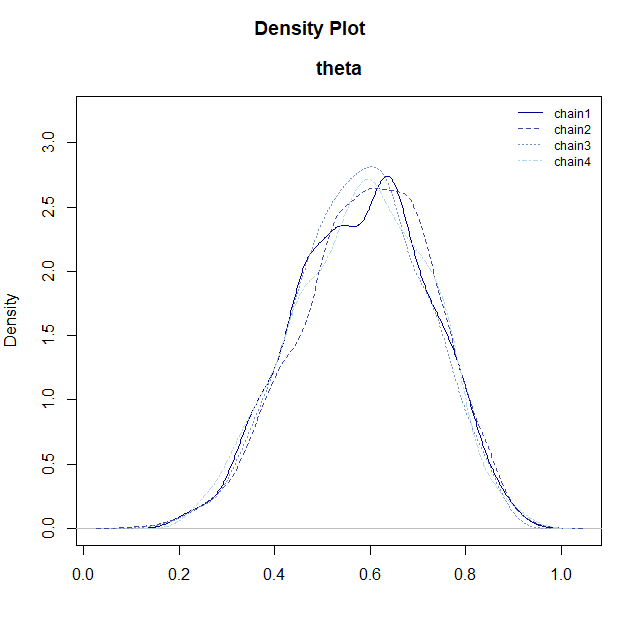
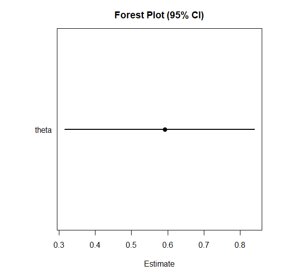

# BayesRTMB クイックスタート

このページでは、**BayesRTMB
を実際に使い始めるための最短ルート**を順を追って説明します。

最初に単純な二項モデルで
[`rtmb_code()`](https://norimune.github.io/BayesRTMB/reference/rtmb_code.md)
と
[`rtmb_model()`](https://norimune.github.io/BayesRTMB/reference/RTMB_Model.md)
の基本的な流れを確認し、
次に回帰モデルで各ブロックの役割を見て、最後に階層モデルで random effect
と Laplace 近似の使い方を確認します。

## このページで扱う流れ

BayesRTMB の基本的な使い方は、次のような4段階です。

1.  **データを用意する**
2.  **[`rtmb_code()`](https://norimune.github.io/BayesRTMB/reference/rtmb_code.md)
    でモデルを書く**
3.  **[`rtmb_model()`](https://norimune.github.io/BayesRTMB/reference/RTMB_Model.md)
    でモデルオブジェクトを作る**
4.  **[`optimize()`](https://rdrr.io/r/stats/optimize.html)・[`sample()`](https://rdrr.io/r/base/sample.html)・`variational()`
    を使って推定をする**

------------------------------------------------------------------------

## 二項分布モデル

最初に、もっとも単純な二項モデルを例に、[`rtmb_code()`](https://norimune.github.io/BayesRTMB/reference/rtmb_code.md)
と
[`rtmb_model()`](https://norimune.github.io/BayesRTMB/reference/RTMB_Model.md)
の基本的な流れを確認します。 ここでは、10 回の試行のうち成功が 6
回観測された状況を扱います。

``` r

library(BayesRTMB)
Trial <- 10
Y <- 6

data_list <- list(Trial = Trial, Y = Y)

model_code <- rtmb_code(
  parameters = {
    theta <- Dim(lower = 0, upper = 1)
  },
  model = {
    Y ~ binomial(Trial, theta)
    theta ~ beta(1, 1)
  }
)
```

### モデルオブジェクト作成

[`rtmb_model()`](https://norimune.github.io/BayesRTMB/reference/RTMB_Model.md)
は、データとモデル定義を受け取って**推定用のモデルオブジェクト**を作る関数です。
最低限必要なのは、観測データをまとめた `data`
と、[`rtmb_code()`](https://norimune.github.io/BayesRTMB/reference/rtmb_code.md)
で作成した `code` です。

この段階ではまだ推定は行われません。
ここで作られたモデルオブジェクトに対して、以後
[`optimize()`](https://rdrr.io/r/stats/optimize.html)、[`sample()`](https://rdrr.io/r/base/sample.html)、`variational()`
を実行していきます。

``` r

mdl <- rtmb_model(data = data_list, code = model_code)
```

``` text
## Pre-checking model code...
## Checking RTMB setup...
```

### MAP推定（事後密度最大推定）

[`optimize()`](https://rdrr.io/r/stats/optimize.html) は MAP
推定を行います。
事後分布の最頻値に対応する推定値を求めたいときに使います。
標準偏差と信頼区間は、デフォルトではWald法（正規分布を仮定した方法）を用います。

``` r

fit_MAP <- mdl$optimize()
fit_MAP
```

``` text
## Call:
## MAP Estimation via RTMB
## 
## Negative Log-Posterior: 1.38
## Approx. Log Marginal Likelihood (Laplace): -2.33
## 
## Point Estimates and 95% Wald CI:
## variable  Estimate  Std. Error  Lower 95%  Upper 95% 
## theta      0.60000     0.15492    0.29740    0.84166 
```

#### 対数周辺尤度の近似値

MAP 推定では、近似対数周辺尤度 `log_ml` が計算されます。 これは
**Laplace
近似**にもとづくモデルの予測の評価指標で、モデル比較の参考になります。

ただし、事後分布が強く歪んでいる場合や多峰的な場合には、近似がうまくいかないので注意が必要です。

``` r

fit_MAP$log_ml
```

``` text
## [1] -2.328722
```

### MCMCで推定

[`sample()`](https://rdrr.io/r/base/sample.html) は NUTS を用いた MCMC
サンプリングを行います。 既定値は `sampling = 1000`, `warmup = 1000`,
`chains = 4`, `thin = 1` です。

``` r

fit_mcmc <- mdl$sample(
  sampling = 1000,
  warmup = 1000,
  chains = 4,
  thin = 1
)
```

``` r

fit_mcmc
```

``` text
## variable   mean    sd    map   q2.5  q97.5  ess_bulk  ess_tail  rhat 
## lp        -3.33  0.74  -2.86  -5.43  -2.80      1712      1744  1.00 
## theta      0.59  0.14   0.62   0.32   0.84      1609      1577  1.00 
```

#### 推論結果の可視化

MCMC で得られた事後分布の形状や収束状況を確認するために、BayesRTMB
にはいくつかの可視化関数が用意されています。

これらの関数は、モデルオブジェクトの `$draws()`
メソッドで抽出したサンプルを渡すことで利用できます。

``` r

# 事後サンプルを抽出
samples <- fit_mcmc$draws("theta")

# 事後密度のプロット
plot_dens(samples)

# トレースプロット（収束の確認）
plot_trace(samples)

# 自己相関プロット
plot_acf(samples)

# フォレストプロット（点推定値と区間の一覧）
plot_forest(samples)
```



- **[`plot_dens()`](https://norimune.github.io/BayesRTMB/reference/plot_dens.md)**:
  パラメータごとの事後分布の密度を表示します。
- **[`plot_trace()`](https://norimune.github.io/BayesRTMB/reference/plot_trace.md)**:
  各チェインがパラメータ空間をどのように移動したかを表示します。複数のチェインが重なり合っている状態になっていれば収束が期待できます。
- **[`plot_acf()`](https://norimune.github.io/BayesRTMB/reference/plot_acf.md)**:
  MCMCサンプルの自己相関をプロットします。
- **[`plot_forest()`](https://norimune.github.io/BayesRTMB/reference/plot_forest.md)**:
  パラメータの点推定値（中央値）と 95% 確信区間を横並びで表示します。

#### bridgesamplingメソッドで対数周辺尤度の計算

`bridgesampling()` を使うと、MCMC
サンプルにもとづいて**対数周辺尤度**を推定できます。
出力には推定誤差も付くため、誤差が大きい場合はサンプル数を増やして精度を上げます。

一度計算した結果は `fit_mcmc$log_ml`
に保存されるため、同じオブジェクトで後から再利用できます。

``` r

fit_mcmc$bridgesampling()

fit_mcmc$log_ml
```

``` text
## [1] -2.401682
## attr(,"error")
## [1] 0.001049984
## attr(,"ess")
## [1] 1204.976
```

## 回帰分析モデル

次に、回帰分析を例に
[`rtmb_code()`](https://norimune.github.io/BayesRTMB/reference/rtmb_code.md)
の各ブロックの役割を解説します。 この例では、

- `setup` でデータの次元を整理し、
- `parameters` で推定するパラメータを宣言し、
- `transform` で平均構造 `mu` を定義し、
- `model` で尤度と事前分布を書く

という流れになっています。

なお、回帰分析や一般化線形（混合）モデルなどの標準的な分析であれば、`rtmb_lm`
や `rtmb_glmer`
といったラッパー関数を使うことで、自分でコードを書かなくてもモデルを自動生成して推定できます。詳しくは
[ラッパー関数の使い方](https://norimune.github.io/BayesRTMB/articles/ja-wrapper_functions.md)
を参照してください。

ここでは、切片と回帰係数に正規分布、残差標準偏差に指数分布を事前分布として与えるモデルを構築します。

データはこのパッケージに入っているdataである討論データを使います。
討論の満足度を目的変数、討論中の発言量、討論パフォーマンス、会話スキル、条件（討論目的）についてのデータです。ここでは発言量、パフォーマンス、会話スキルのデータを使います。

``` r

data(discussion)

Y <- discussion$satisfaction
X_names <- c("talk", "performance", "skill")
X <- subset(discussion, select = X_names)

data_reg <- list(Y = Y, X = X)

code_reg <- rtmb_code(
  setup = {
    N <- length(Y)
    P <- ncol(X)
  },
  parameters = {
    alpha <- Dim()
    beta <- Dim(P)
    sigma <- Dim(lower = 0)
  },
  transform = {
    mu <- alpha + beta[1] * X[, 1] + beta[2] * X[, 2] + beta[3] * X[, 3]
  },
  model = {
    Y ~ normal(mu, sigma)
    alpha ~ normal(0, 100)
    beta ~ normal(0, 10)
    sigma ~ exponential(1 / 10)
  }
)
```

### モデルに名前と初期値を入れる

[`rtmb_model()`](https://norimune.github.io/BayesRTMB/reference/RTMB_Model.md)
では`par_names`で変数の名前を入れておくと、結果が見やすくなります。たとえば回帰係数betaにそれぞれ対応する説明変数を入れておくと`beta[talk]`などと表示されるようになります。
また、`init` を指定して初期値を与えることができます。
初期値を明示しておくと、複雑なモデルで推定が安定しやすくなることがあります。
一部のパラメータだけ指定した場合は、残りを自動で補うこともできます。

``` r

mdl_reg <- rtmb_model(
  data = data_reg,
  code = code_reg,
  par_names = list(beta = X_names),
  init = list(alpha = 0, beta = c(0, 0, 0))
)
```

``` r

mcmc_reg <- mdl_reg$sample()
mcmc_reg
```

``` text
##          variable     mean    sd      map     q2.5    q97.5  ess_bulk  ess_tail  rhat 
## lp                 -411.40  1.68  -410.25  -415.73  -409.27       982       867  1.00 
## alpha                 1.51  0.25     1.56     1.02     1.97       632       671  1.01 
## beta[talk]            0.27  0.05     0.27     0.17     0.37       848      1193  1.01 
## beta[performance]     0.15  0.03     0.15     0.10     0.21       845       965  1.00 
## beta[skill]           0.19  0.07     0.19     0.07     0.32       874      1124  1.00 
## sigma                 0.90  0.04     0.90     0.83     0.97       858      1195  1.01 
## mu[1]                 2.96  0.10     2.96     2.76     3.16       857      1153  1.00 
## mu[2]                 3.08  0.11     3.09     2.86     3.29      1300      1896  1.00 
## mu[3]                 2.96  0.10     2.96     2.76     3.16       857      1153  1.00 
## mu[4]                 3.34  0.09     3.35     3.16     3.53      1467      1625  1.00 
```

#### bayes_factor

[`bayes_factor()`](https://norimune.github.io/BayesRTMB/reference/bayes_factor.md)
を使うと、推定したモデルと帰無モデルの周辺尤度を比較し、**ベイズファクター**を計算できます。
`null_model = "beta[talk]"` のように指定すると、その係数を 0
に固定した帰無モデルを内部で作成して比較します。

係数の予測に対する寄与をベイズ的に評価したいときに便利です。

``` r

bf_result <- mcmc_reg$bayes_factor(null_model = "beta[talk]")
bf_result
```

``` text
## Bayes Factor (BF12) : 1047.097 
## Log Bayes Factor    : 6.9538 (Approx. Error = 0.0051)
## Interpretation      : Decisive evidence for Model 1 
```

------------------------------------------------------------------------

## 階層線形モデル

あるパラメータの集団差をさらにモデリングしたいとき階層線形モデルが役立ちます。データの確率モデルに含まれるパラメータが、さらに確率モデルを持つとき、階層モデルと呼びます。

階層モデルの分析例として今回も `discussion` データを用います。
ここでは集団ごとの切片のランダム効果を導入し、集団差を表現します。

``` r

data(discussion)

Y <- discussion$satisfaction
X_names <- c("talk", "performance", "skill")
X <- subset(discussion, select = X_names)
group <- discussion$group

data_hlm <- list(Y = Y, X = X, group = group)

code_hlm <- rtmb_code(
  setup = {
    N <- length(Y)
    G <- length(unique(group))
    P <- ncol(X)
  },
  parameters = {
    alpha <- Dim()
    beta <- Dim(P)
    tau <- Dim(lower = 0)
    sigma <- Dim(lower = 0)
    r <- Dim(G, random = TRUE)
  },
  transform = {
    mu <- alpha + X %*% beta + r[group] * tau
  },
  model = {
    Y ~ normal(mu, sigma)
    r ~ normal(0, 1)
    alpha ~ normal(0, 100)
    beta ~ normal(0, 10)
    tau ~ exponential(1 / 10)
    sigma ~ exponential(1 / 10)
  }
)
```

`view`
をモデル作成時に指定しておくと、要約結果の表示がわかりやすくなります。`view`
は [`summary()`](https://rdrr.io/r/base/summary.html)
などで優先的に上に表示したい変数を指定するために使います。

この例では `view` を使って
[`summary()`](https://rdrr.io/r/base/summary.html)で`tau`を`sigma`より優先表示するように指定しています。
出力の可読性を高めたい場合は、`view`であらかじめ設定しておくと便利です。

``` r

mdl_hlm <-
  rtmb_model(
    data = data_hlm,
    code = code_hlm,
    par_names = list(beta = X_names),
    view = c("alpha", "beta", "tau", "sigma")
  )
```

### ラプラス近似によるMAP推定

`optimize(laplace = TRUE)` (デフォルトはTRUE)とすると、ランダム効果を
**Laplace 近似**で積分消去しながら固定効果を推定できます。
階層モデルでは計算をかなり軽くできることが多く、まず MAP
で全体像を確認したいときに有用です。

また、optimizeでは、デフォルトでは事後分布が正規分布であるという前提で標準誤差や信頼区間を推定しますが、`df`オプションを指定することでt分布による信頼区間も表示できます。さらに、`df="auto"`とすると、サタースウェイトの自由度推定を行います。階層線形モデルなどのマルチレベルモデルではこの方法を用いると説明変数の情報量に応じて自由度が自動推定されます。

``` r

opt_hlm <- mdl_hlm$optimize(df = "auto")
opt_hlm$summary(c("alpha","beta","tau","sigma"))
```

``` text
## Call:
## MAP Estimation via RTMB
## 
## Negative Log-Posterior: 399.48
## Approx. Log Marginal Likelihood (Laplace): -411.83
## Note: Random effects are stored in $random_effects (use ranef = TRUE to show them)
## 
## Point Estimates and 95% Wald CI:
##          variable  Estimate  Std. Error  Lower 95%  Upper 95%    DF 
## alpha               1.52450     0.25733    1.01716    2.03185   205 
## beta[talk]          0.23487     0.05323    0.13013    0.33961   311 
## beta[performance]   0.15451     0.03713    0.08085    0.22818    99 
## beta[skill]         0.22613     0.05990    0.10822    0.34405   274 
## tau                 0.48512     0.06507    0.36576    0.64343    17 
## sigma               0.74836     0.03755    0.67772    0.82637   148 
```

事前分布の違いはありますが、laplace近似の推定は最尤推定のlme4とほぼ同じ結果が出ます。（※注：`lme4`
は `BayesRTMB`
の実行には不要ですが、以下のコードは比較のための参考として利用してください。もしご自身の環境で実行する場合は
`lme4` を別途インストールしておく必要があります）

``` r

library(lme4)
result <-
  lmer(satisfaction ~ talk + performance + skill + (1 | group),
    data = discussion, REML = FALSE
  )

result |> summary()
```

``` text
## Linear mixed model fit by maximum likelihood  ['lmerMod']
## Formula: satisfaction ~ talk + performance + skill + (1 | group)
##    Data: discussion
## 
##       AIC       BIC    logLik -2*log(L)  df.resid 
##     771.1     793.4    -379.6     759.1       294 
## 
## Scaled residuals: 
##      Min       1Q   Median       3Q      Max 
## -3.15138 -0.51022  0.03797  0.54144  2.87725 
## 
## Random effects:
##  Groups   Name        Variance Std.Dev.
##  group    (Intercept) 0.2357   0.4855  
##  Residual             0.5601   0.7484  
## Number of obs: 300, groups:  group, 100
## 
## Fixed effects:
##             Estimate Std. Error t value
## (Intercept)  1.52449    0.25735   5.924
## talk         0.23485    0.05286   4.443
## performance  0.15451    0.03714   4.160
## skill        0.22616    0.05960   3.795
## 
## Correlation of Fixed Effects:
##             (Intr) talk   prfrmn
## talk        -0.516              
## performance -0.632 -0.056       
## skill       -0.387 -0.138 -0.020
```

#### 信頼区間の設定

optimizeでは、それ以外にもサンプリングによる信頼区間の推定と、尤度プロファイル法による信頼区間の推定が可能です。

``` r

opt_hlm <- mdl_hlm$optimize(df = "auto", ci_method = "sampling")
opt_hlm$summary(c("alpha","beta","tau","sigma"))
```

``` text
## Call:
## MAP Estimation via RTMB
## 
## Negative Log-Posterior: 399.48
## Approx. Log Marginal Likelihood (Laplace): -411.83
## Note: Random effects are stored in $random_effects (use ranef = TRUE to show them)
## 
## Point Estimates and 95% Sampling-based CI:
##          variable  Estimate  Std. Error  Lower 95%  Upper 95%   DF 
## alpha               1.52450     0.25672    1.02423    2.04694  205 
## beta[talk]          0.23487     0.05181    0.13788    0.33975  311 
## beta[performance]   0.15451     0.03654    0.07911    0.22626   99 
## beta[skill]         0.22613     0.06036    0.10550    0.34844  274 
## tau                 0.48512     0.07084    0.36055    0.63918   17 
## sigma               0.74836     0.03752    0.67921    0.82579  148 
```

`profile`メソッドを使うと、尤度プロファイル法で信頼区間の計算ができます。これは`lme4`パッケージの[`confint()`](https://rdrr.io/r/stats/confint.html)と同じ機能で、実際同じ結果が出ます(事前分布があるので完全には一致しません)。

``` r

opt_hlm$profile("beta")
```

``` text
## Estimating confidence intervals via Profile Likelihood...
##   Profiling 3/3 (beta[skill])...                                                         ##              
## Done.
## 
## Profile Likelihood Confidence Intervals:
##  variable          Estimate Lower 2.5% Upper 97.5%
##  beta[talk]        0.23487  0.13020    0.33950    
##  beta[performance] 0.15451  0.08107    0.22802    
##  beta[skill]       0.22613  0.10803    0.34363   
```

laplace近似で周辺化されたランダム効果の推定結果は `random_effects`
に別途保存されます。

``` r

opt_hlm$random_effects$Estimate |> hist()
```


ランダム効果

### MCMC

階層モデルでも [`sample()`](https://rdrr.io/r/base/sample.html)
によってMCMC推定で安定して推定可能です。
チェイン数が多い場合やモデルが重い場合は、`parallel = TRUE`
を指定して並列計算することもできます。1回目は並列化のためのワーカー立ち上げに時間がかかりますが、2回目以降は高速に立ち上がります。

収束診断を確認しながら、必要なら `warmup` や `sampling`
を増やしていきます。

``` r

mcmc_hlm <- mdl_hlm$sample(parallel = TRUE)
mcmc_hlm$summary()
```

``` text
##          variable     mean     sd      map     q2.5    q97.5  ess_bulk  ess_tail  rhat 
## lp                 -503.48  11.43  -502.73  -527.43  -482.45       845      1883  1.00 
## alpha                 1.53   0.26     1.50     1.02     2.04      1885      2572  1.00 
## beta[talk]            0.24   0.06     0.23     0.13     0.34      3292      3346  1.00 
## beta[performance]     0.15   0.04     0.16     0.08     0.23      1724      2415  1.00 
## beta[skill]           0.23   0.06     0.21     0.10     0.34      4128      3016  1.00 
## tau                   0.50   0.07     0.50     0.36     0.63      1532      1885  1.00 
## sigma                 0.76   0.04     0.76     0.69     0.84      2123      3211  1.00 
## r[1]                  0.02   0.66     0.00    -1.28     1.27      6016      2961  1.00 
## r[2]                 -0.56   0.66    -0.47    -1.86     0.73      5403      2966  1.00 
## r[3]                 -0.75   0.68    -0.77    -2.07     0.58      5041      3202  1.00 
```

MCMCでもlaplace近似を実行できます。推定結果は変わりませんが、MCMCの自己相関は下がりやすいので、収束は安定します。ただ、推定時間は長くなるので、一長一短です。MCMCで十分収束するなら、laplace近似を特別使う必要はないかも知れません。
ただ、WAICなどの予測指標を使うとき、階層化するときとしないときの比較が難しいので、laplace近似が自動でできると便利なときもあります。

``` r

mcmc_hlm_l <- mdl_hlm$sample(laplace = TRUE, parallel = TRUE)
```

#### MCMC結果の保存と読み込み (save_csv)

計算に時間がかかるモデルや大規模なサンプリングを行う場合、結果を CSV
ファイルとして保存しておくと便利です。
[`sample()`](https://rdrr.io/r/base/sample.html)（または
`variational()`）の実行時に `save_csv`
引数を指定すると、指定したディレクトリにチェインごとのサンプリング結果が書き出されます。

``` r

# 結果を "mcmc_out" ディレクトリに "my_model_chain_X.csv" という名前で保存
mcmc_hlm <- mdl_hlm$sample(
  save_csv = list(name = "my_model", dir = "mcmc_out")
)
```

保存された結果は、後で
[`read_mcmc_csv()`](https://norimune.github.io/BayesRTMB/reference/read_mcmc_csv.md)
関数を使ってモデルオブジェクトに読み戻すことができます。これにより、セッションを閉じたり
R
を再起動した後でも、サンプリング結果を再利用してプロットや要約を行うことが可能です。

``` r

# 保存されたファイルを読み込む
# (mdl は同じ設定で作られたモデルオブジェクトである必要があります)
mcmc_hlm_read <- read_mcmc_csv(mdl, name = "my_model", dir = "mcmc_out")
```

### モデル比較

対数周辺尤度を計算することで、モデル比較ができます。

先ほどの回帰分析の結果と階層線形モデルの比較をしてみましょう。
変量効果を推定することによってどれほどモデルは改善したのでしょう。

上で解説したようにMAP推定でも対数周辺尤度を計算できるので、近似的にモデル比較ができます。

``` r

opt_reg <- mdl_reg$optimize()
opt_reg$log_ml
opt_hlm$log_ml
```

``` text
## > opt_reg$log_ml
## [1] -419.6358
## > opt_hlm$log_ml
## [1] -411.8348
```

ただし、MAP推定の対数周辺尤度はあくまで近似値なので、より正確にするにはMCMC推定の結果をbridgesamplingで計算する方がいいです。特に、MAPは変量効果があるときにラプラス近似を使うので、対数周辺尤度はラプラス近似を使わないMCMCと少し値が変わります。

``` r

mcmc_reg$bridgesampling()
mcmc_hlm$bridgesampling()
```

``` text
## > mcmc_reg$bridgesampling()
## Bridge Sampling Converged: LogML = -419.608 (Error = 0.0039, ESS = 830.6)
## [1] -419.6081
## attr(,"error")
## [1] 0.003854939
## attr(,"ess")
## [1] 830.623
## > mcmc_hlm$bridgesampling()
## Bridge Sampling Converged: LogML = -412.675 (Error = 0.0401, ESS = 760.2)
## [1] -412.6746
## attr(,"error")
## [1] 0.04009978
## attr(,"ess")
## [1] 760.1723
```

ラプラス近似を使ったMCMCは、MAPの結果に近いです。

``` r

mcmc_hlm_l$bridgesampling()
```

``` text
## > mcmc_hlm_l$bridgesampling()
## Bridge Sampling Converged: LogML = -411.770 (Error = 0.0053, ESS = 994.9)
## [1] -411.7704
## attr(,"error")
## [1] 0.005318097
## attr(,"ess")
## [1] 994.8858
```

## GLMM

一般化線形混合モデル(GLMM)も可能です。

討論満足度は5件法で測定されているため、順序データとして扱えます。
そこで、順序ロジスティック分布を仮定した、マルチレベル分析を実行してみます。

``` r

data(discussion)

Y <- discussion$satisfaction
X_names <- c("talk", "performance", "skill")
X <- subset(discussion, select = X_names)
group <- discussion$group

data_glmm <- list(Y = Y, X = X, group = group)

code_glmm <- rtmb_code(
  setup = {
    N <- length(Y)
    G <- length(unique(group))
    P <- ncol(X)
    K <- length(unique(Y))
  },
  parameters = {
    alpha <- Dim(K - 1, type = "ordered") # 順序制約のあるベクトル
    beta <- Dim(P)
    tau <- Dim(lower = 0)
    r <- Dim(G, random = TRUE)
  },
  transform = {
    mu <- X %*% beta + r[group] * tau
  },
  model = {
    Y ~ ordered_logistic(mu, alpha) # 順序ロジスティック分布も実装されている
    r ~ normal(0, 1)
    alpha ~ normal(0, 2.5)
    beta ~ normal(0, 10)
    tau ~ exponential(1 / 10)
  }
)
```

### モデルの読み込み

``` r

mdl_glmm <- rtmb_model(data_glmm, code_glmm,
  par_names = list(beta = X_names)
)
```

### ラプラス近似によるGLMM

変量効果を積分消去した推定で、glmmもMAP推定が可能です。

``` r

opt_glmm <- mdl_glmm$optimize()
opt_glmm
```

``` text
## Call:
## MAP Estimation via RTMB
## 
## Negative Log-Posterior: 391.24
## Approx. Log Marginal Likelihood (Laplace): -397.74
## Note: Random effects are stored in $random_effects
## 
## Point Estimates and 95% Wald CI:
##          variable  Estimate  Std. Error  Lower 95%  Upper 95% 
## alpha[1]           -0.30770     0.65457   -1.59063    0.97522 
## alpha[2]            1.48733     0.60548   -0.32034    3.51175 
## alpha[3]            4.25193     0.63446    1.98068    6.83335 
## alpha[4]            6.50517     0.70195    3.81621    9.59934 
## beta[talk]          0.50442     0.13449    0.24082    0.76802 
## beta[performance]   0.32810     0.09502    0.14186    0.51434 
## beta[skill]         0.49771     0.15633    0.19131    0.80411 
## tau                 1.27056     0.21778    0.90803    1.77784 
## mu[1,1]             2.81917     0.93273    0.99105    4.64730 
## mu[2,1]             3.31017     0.97502    1.39917    5.22117 
```

## 混合分布モデル

複数の分布が混ざったデータを推定することもできます。
まずはデータ生成を行います。

``` r

set.seed(123)

N <- 300 # サンプルサイズ
K <- 3 # クラスタの数

# 真のパラメータ
theta_true <- c(0.2, 0.5, 0.3) # 各クラスタの混合比率 (和が1)
mu_true <- c(-3, 0, 4) # 各クラスタの平均
sigma_true <- c(0.5, 1.0, 0.8) # 各クラスタの標準偏差

# 潜在変数 z (各データ点がどのクラスタから生成されたか)
z <- sample(1:K, size = N, replace = TRUE, prob = theta_true)

# 観測データ Y
Y <- numeric(N)
for (i in 1:N) {
  Y[i] <- rnorm(1, mean = mu_true[z[i]], sd = sigma_true[z[i]])
}

Y |> hist()

data_mix <- list(Y = Y)
```

以下がコードになります。

``` r

code_mix <- rtmb_code(
  setup = {
    K <- 3 # クラスタ数
  },
  parameters = {
    theta <- Dim(K, type = "simplex") # 総和が1になる正のベクトル 混合率でよく使う
    mu <- Dim(K)
    sigma <- Dim(K, lower = 0)
  },
  model = {
    mu ~ normal(0, 5)
    sigma ~ exponential(1)
    theta ~ dirichlet(rep(1, K)) # ディリクレ分布を事前分布にする
    Y ~ normal_mixture(theta, mu, sigma) # 混合正規分布が用意されている
  }
)
```

### モデルの用意

``` r

mdl_mix <- rtmb_model(data_mix, code_mix)
```

### 初期値の設定

混合分布モデルは、そのまま推定するとラベルスイッチングがよく生じます。
ラベルスイッチングとは、チェインごとでクラスタのラベルづけが変わってしまう現象です。
MCMCでは避けては通れないですが、初期値を与えると起きにくくなります。

そこで、MAP推定値を使います。ただ、混合分布モデルは初期値依存で局所最適解に陥ることがよくあるので、複数のMAPを走らせます。`num_estimate = 8`とすることで8回走らせることができます。

``` r

opt_mix <- mdl_mix$optimize(num_estimate = 8)
```

``` text
## Starting optimization...
## Optimization run 8/8...
## 
## Optimization Diagnostics per estimate:
##   est1: Objective =     711.49, Code = 0 (Converged)
##   est2: Objective =     711.49, Code = 0 (Converged)
##   est3: Objective =     655.84, Code = 0 (Converged)  <-- BEST
##   est4: Objective =     695.90, Code = 0 (Converged)
##   est5: Objective =     655.84, Code = 0 (Converged)
##   est6: Objective =     675.00, Code = 0 (Converged)
##   est7: Objective =     713.57, Code = 0 (Converged)
##   est8: Objective =     676.45, Code = 0 (Converged)
```

このBestの結果を初期値にしてMCMCを走らせます。すると、ラベルスイッチングが生じにくいです。
なお、MCMCの初期値には`init_jitter`でchainごとに揺らすことができます。

``` r

mcmc_mix <- mdl_mix$sample(init = opt_mix$par, init_jitter = 0.2)
mcmc_mix
```

``` text
## variable     mean    sd      map     q2.5    q97.5  ess_bulk  ess_tail  rhat 
## lp        -664.57  2.05  -663.46  -669.30  -661.57      1717      2894  1.00 
## theta[1]     0.29  0.03     0.29     0.24     0.35      3928      2829  1.00 
## theta[2]     0.18  0.03     0.18     0.13     0.23      3274      2909  1.00 
## theta[3]     0.53  0.04     0.53     0.46     0.60      2790      2986  1.00 
## mu[1]        3.93  0.10     3.94     3.72     4.13      3551      2683  1.00 
## mu[2]       -2.98  0.09    -2.97    -3.15    -2.80      3210      3099  1.00 
## mu[3]        0.03  0.11     0.02    -0.19     0.23      3506      3255  1.00 
## sigma[1]     0.77  0.08     0.74     0.62     0.96      2724      2573  1.00 
## sigma[2]     0.51  0.07     0.49     0.39     0.67      3459      3004  1.00 
## sigma[3]     1.07  0.12     1.04     0.87     1.33      2758      2518  1.00  
```

## まとめ

このページでは、BayesRTMB の基本的な流れを 3 つのモデルで確認しました。

- **単純なモデル**では、[`rtmb_code()`](https://norimune.github.io/BayesRTMB/reference/rtmb_code.md)
  と
  [`rtmb_model()`](https://norimune.github.io/BayesRTMB/reference/RTMB_Model.md)
  の最小構成を確認する
- **回帰モデル**では、`setup`・`parameters`・`transform`・`model`
  の役割を理解する
- **階層モデル**では、random effect と Laplace 近似の使い方を確認する

最初は MAP でモデルの動作を確認し、その後に MCMC や ADVI
を試す流れがわかりやすいです。
より詳しく確認したい場合は、[日本語紹介ページ](https://norimune.github.io/BayesRTMB/articles/ja-introduction.md)
と Reference をあわせて見ると全体像をつかみやすくなります。

### 次のステップ

BayesRTMB
の全体像がつかめたら、以下の順番でドキュメントを参照して具体的な使い方を深めていくことをおすすめします。

1.  **[ラッパー関数の使い方](https://norimune.github.io/BayesRTMB/articles/ja-wrapper_functions.md)**
    `rtmb_glm`や`rtmb_fa`を用いることで、GLMや因子分析など心理統計でよく用いる分析法を簡単に実行できます。
2.  **[コードの書き方](https://norimune.github.io/BayesRTMB/articles/ja-writing_models.md)**
    各関数の詳細な仕様を確認できます。 3.**その他リファレンス**
    特に自分でモデルを構築する際は、以下のページが役立ちます。
    - [`rtmb_code()`](https://norimune.github.io/BayesRTMB/reference/rtmb_code.md):
      各ブロックの記述ルールと仕様
    - [`Dim()`](https://norimune.github.io/BayesRTMB/reference/Dim.md):
      パラメータの型と制約（`parameter_types`）
    - `distributions` / `math_functions`:
      組み込みの確率分布や、数値計算を安定させる数学関数
