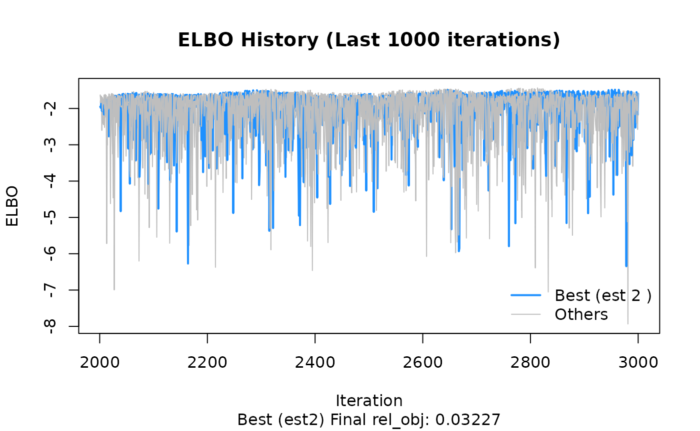
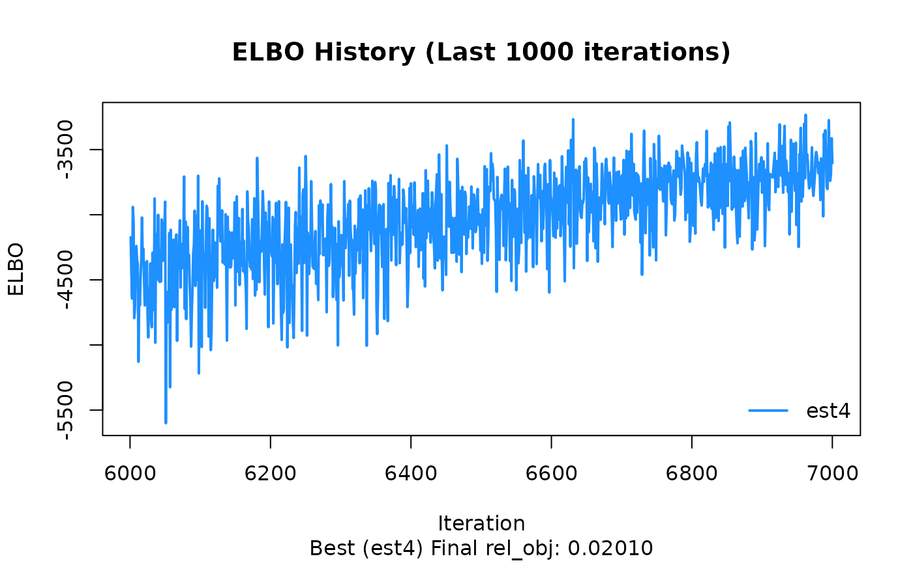

# BayesRTMB 日本語クイックスタート

このページでは、**BayesRTMB
を実際に使い始めるための最短ルート**を順を追って説明します。

最初に単純な二項モデルで
[`rtmb_code()`](https://norimune.github.io/BayesRTMB/reference/rtmb_code.md)
と
[`rtmb_model()`](https://norimune.github.io/BayesRTMB/reference/RTMB_Model.md)
の基本的な流れを確認し、
次に回帰モデルで各ブロックの役割を見て、最後に階層モデルで random effect
と Laplace 近似の使い方を確認します。

## このページで扱う流れ

BayesRTMB の基本的な使い方は、ほぼ次の 3 段階にまとまります。

1.  **データを用意する**
2.  **[`rtmb_code()`](https://norimune.github.io/BayesRTMB/reference/rtmb_code.md)
    でモデルを書く**
3.  **[`rtmb_model()`](https://norimune.github.io/BayesRTMB/reference/RTMB_Model.md)
    でモデルオブジェクトを作り、[`optimize()`](https://rdrr.io/r/stats/optimize.html)・[`sample()`](https://rdrr.io/r/base/sample.html)・`variational()`
    を使う**

------------------------------------------------------------------------

## Binomial model

最初に、もっとも単純な二項モデルを例に、[`rtmb_code()`](https://norimune.github.io/BayesRTMB/reference/rtmb_code.md)
と
[`rtmb_model()`](https://norimune.github.io/BayesRTMB/reference/RTMB_Model.md)
の基本的な流れを確認します。 ここでは、10 回の試行のうち成功が 6
回観測された状況を扱います。

``` r
library(BayesRTMB)
```

    ## Loading required package: RTMB

``` r
Trial <- 10
Y <- 6

data_list <- list(Trial = Trial, Y = Y)

model_code <- rtmb_code(
  parameters={
    theta=Dim(lower=0,upper=1)
  },
  model={
    Y~binomial(Trial,theta)
    theta ~ beta(2,2)
  }
)
```

### rtmb_model

[`rtmb_model()`](https://norimune.github.io/BayesRTMB/reference/RTMB_Model.md)
は、データとモデル定義を受け取って**推定用のモデルオブジェクト**を作る関数です。
最低限必要なのは、観測データをまとめた `data`
と、[`rtmb_code()`](https://norimune.github.io/BayesRTMB/reference/rtmb_code.md)
で作成した `code` です。

この段階ではまだ推定は行われません。
ここで作られたモデルオブジェクトに対して、以後
[`optimize()`](https://rdrr.io/r/stats/optimize.html)、[`sample()`](https://rdrr.io/r/base/sample.html)、`variational()`
を実行していきます。

``` r
mdl <- rtmb_model(data = data_list, code = model_code)
```

    ## Pre-checking model code...
    ## Checking RTMB setup...

### MAP

[`optimize()`](https://rdrr.io/r/stats/optimize.html) は MAP
推定を行います。
事後分布の最頻値に対応する**点推定**を求めたいときに使います。
まずは追加オプションなしで実行し、推定値と区間推定の出力を確認します。

``` r
fit_MAP <- mdl$optimize()
```

    ## Starting optimization...
    ## 
    ## Optimization converged. Final objective: 1.01

``` r
fit_MAP
```

    ## 
    ## Call:
    ## MAP Estimation via RTMB
    ## 
    ## Negative Log-Posterior: 1.01
    ## Approx. Log Marginal Likelihood (Laplace): -0.63
    ## 
    ## Point Estimates and 95% Wald CI:
    ## variable  Estimate  Std. Error  Lower 95%  Upper 95% 
    ## theta      0.58309     0.14234    0.30743    0.81504

#### se_sampling

`se_sampling = TRUE`
を指定すると、推定結果の不確実性を使って、**シミュレーションベースで標準誤差と
95% 区間**を計算します。 この方法を使うと、`transform`
で作成した派生量や `generate`
で作成した量についても区間推定を出しやすくなります。

派生量の信頼区間まで含めて見たいときに便利です。

``` r
fit_MAP <- mdl$optimize(se_sampling = TRUE)
```

    ## Starting optimization...
    ## 
    ## Optimization converged. Final objective: 1.01
    ## Using simulation-based error propagation (1000 samples)...

``` r
fit_MAP
```

    ## 
    ## Call:
    ## MAP Estimation via RTMB
    ## 
    ## Negative Log-Posterior: 1.01
    ## Approx. Log Marginal Likelihood (Laplace): -0.63
    ## 
    ## Point Estimates and 95% Wald CI:
    ## variable  Estimate  Std. Error  Lower 95%  Upper 95% 
    ## theta      0.58309     0.13505    0.30462    0.81333

#### log_ml

MAP 推定では、近似対数周辺尤度 `log_ml` が計算されます。 これは
**Laplace 近似**にもとづく量で、モデル比較の参考になります。

ただし、事後分布が強く歪んでいる場合や多峰的な場合には、注意が必要です。

``` r
fit_MAP$log_ml
```

    ## [1] -0.6277343

### MCMC

[`sample()`](https://rdrr.io/r/base/sample.html) は NUTS を用いた MCMC
サンプリングを行います。 既定値は `sampling = 1000`, `warmup = 1000`,
`chains = 4`, `thin = 1` です。

``` r
fit_mcmc <- mdl$sample(sampling = 1000,
                       warmup   = 1000,
                       chains   = 4,
                       thin     = 1
                       )
```

``` r
fit_mcmc
```

    ## variable   mean    sd    map   q2.5  q97.5  ess_bulk  ess_tail  rhat 
    ## lp        -2.96  0.74  -2.48  -5.00  -2.42      1846      2152  1.00 
    ## theta      0.58  0.13   0.58   0.31   0.81      1170      1901  1.00

#### bridgesampling

`bridgesampling()` を使うと、MCMC
サンプルにもとづいて**対数周辺尤度**を推定できます。
出力には推定誤差も付くため、誤差が大きい場合はサンプル数を増やして精度を上げます。

一度計算した結果は `fit_mcmc$log_ml`
に保存されるため、同じオブジェクトで後から再利用できます。

``` r
fit_mcmc$bridgesampling()
```

    ## Bridge Sampling Converged: LogML = -2.102 (Error = 0.0012, ESS = 1354.1)

    ## [1] -2.101626
    ## attr(,"error")
    ## [1] 0.001203673
    ## attr(,"ess")
    ## [1] 1354.054

``` r
fit_mcmc$log_ml
```

    ## [1] -2.101626
    ## attr(,"error")
    ## [1] 0.001203673
    ## attr(,"ess")
    ## [1] 1354.054

### ADVI

`variational()` は、自動微分変分ベイズ法による**近似推定**を行います。
MCMC
より高速に結果の概形をつかみたいときに便利ですが、あくまで近似法なので、難しいモデルでは精度確認が重要です。

`iter` は最適化の反復回数です。 ELBO
の推移を見ながら、十分に収束しているかを確認します。

``` r
fit_vb$plot_elbo()
```



``` r
fit_vb
```

    ## variable   mean    sd    map   q2.5  q97.5 
    ## lp        -2.95  0.74  -2.49  -5.18  -2.42 
    ## theta      0.58  0.13   0.61   0.32   0.82

#### ADVI のモデル評価指標

ADVI では ELBO（変分下界）が出力されます。 ELBO
は近似分布の良さを見るための指標で、値が大きいほど、その近似分布のもとでは望ましい方向にあります。

ただし、ELBO は**真の対数周辺尤度そのものではありません**。
とくに、事後分布が強く歪んでいる場合や、パラメータ間の依存が強い場合には、ELBO
と真の対数周辺尤度が大きくずれることがあります。

``` r
fit_vb$ELBO
```

    ## [1] -2.111785 -2.080551 -2.099451 -2.107483

------------------------------------------------------------------------

## Regression model

次に、回帰分析を例に
[`rtmb_code()`](https://norimune.github.io/BayesRTMB/reference/rtmb_code.md)
の各ブロックの役割を確認します。 この例では、

- `setup` でデータの次元を整理し、
- `parameters` で推定するパラメータを宣言し、
- `transform` で平均構造 `mu` を定義し、
- `model` で尤度と事前分布を書く

という流れになっています。

ここでは、切片と回帰係数に正規分布、残差標準偏差に指数分布を事前分布として与えています。

``` r
set.seed(123)
alpha <- 5
beta <- c(1)
sigma <- 2
N <- 50
X <- matrix(seq(1, 5, length.out = N), ncol = 1)
Y <- alpha + X[, 1] * beta + rnorm(N, 0, sigma)

data_reg <- list(Y = Y, X = X)

code_reg <- rtmb_code(
  setup = {
    N <- length(Y)
    P <- ncol(X)
  },
  parameters = {
    alpha   = Dim()
    beta    = Dim(P)
    sigma   = Dim(lower=0)
  },
  transform = {
    mu = alpha + as.vector(X %*% beta)
  },
  model = {
    Y ~ normal(mu, sigma)
    alpha ~ normal(0, 100)
    beta  ~ normal(0, 10)
    sigma ~ exponential(1/10)
  }
)
```

### rtmb_model

[`rtmb_model()`](https://norimune.github.io/BayesRTMB/reference/RTMB_Model.md)
では `init` を指定して初期値を与えることができます。
初期値を明示しておくと、複雑なモデルで推定が安定しやすくなることがあります。
一部のパラメータだけ指定した場合は、残りを自動で補うこともできます。

``` r
mdl_reg <- rtmb_model(data_reg, code_reg, init = list(alpha = 0, beta = 0))
```

    ## Pre-checking model code...
    ## Checking RTMB setup...

### MAP

`par_names` や `view`
をモデル作成時に指定しておくと、要約結果の表示がわかりやすくなります。
`par_names` はパラメータの表示名を付けるために使い、`view` は
[`summary()`](https://rdrr.io/r/base/summary.html)
などで優先的に上に表示したい変数を指定するために使います。

この例では未指定ですが、階層モデルの例で実際の使い方を示します。

``` r
opt_reg <- mdl_reg$optimize(se_sampling=TRUE)
```

    ## Starting optimization...
    ## 
    ## Optimization converged. Final objective: 112.47
    ## Using simulation-based error propagation (1000 samples)...

``` r
opt_reg$summary()
```

    ## 
    ## Call:
    ## MAP Estimation via RTMB
    ## 
    ## Negative Log-Posterior: 112.47
    ## Approx. Log Marginal Likelihood (Laplace): -114.89
    ## 
    ## Point Estimates and 95% Wald CI:
    ## variable  Estimate  Std. Error  Lower 95%  Upper 95% 
    ## alpha      5.16974     0.70841    3.83342    6.59727 
    ## beta       0.96635     0.21849    0.53493    1.39906 
    ## sigma      1.82755     0.18022    1.50302    2.20726 
    ## mu[1]      6.13609     0.51081    5.18426    7.17728 
    ## mu[2]      6.21498     0.49545    5.29736    7.23522 
    ## mu[3]      6.29386     0.48027    5.40404    7.27574 
    ## mu[4]      6.37275     0.46527    5.50768    7.33337 
    ## mu[5]      6.45163     0.45049    5.61612    7.38735 
    ## mu[6]      6.53052     0.43592    5.71593    7.42122 
    ## mu[7]      6.60941     0.42162    5.81563    7.46393

### MCMC

回帰モデルでも [`sample()`](https://rdrr.io/r/base/sample.html)
を使えば事後分布全体を評価できます。 MAP では点推定が中心ですが、MCMC
では分布の形、不確実性、パラメータ間のばらつきまで確認できます。

``` r
mcmc_reg <- mdl_reg$sample()
```

``` r
mcmc_reg
```

    ## variable     mean    sd      map     q2.5    q97.5  ess_bulk  ess_tail  rhat 
    ## lp        -113.36  1.19  -112.38  -116.46  -111.98      1157       917  1.00 
    ## alpha        5.21  0.73     5.16     3.80     6.63       691       889  1.00 
    ## beta         0.95  0.23     0.89     0.50     1.39       696       589  1.00 
    ## sigma        1.91  0.19     1.90     1.58     2.32       833      1665  1.01 
    ## mu[1]        6.16  0.53     6.17     5.14     7.21       743       917  1.00 
    ## mu[2]        6.24  0.51     6.26     5.25     7.25       752       926  1.00 
    ## mu[3]        6.32  0.49     6.33     5.35     7.30       763       928  1.00 
    ## mu[4]        6.39  0.48     6.41     5.46     7.34       776       929  1.00 
    ## mu[5]        6.47  0.46     6.48     5.58     7.39       789       995  1.00 
    ## mu[6]        6.55  0.45     6.56     5.68     7.43       805      1013  1.00

#### bayes_factor

[`bayes_factor()`](https://norimune.github.io/BayesRTMB/reference/bayes_factor.md)
を使うと、推定したモデルと帰無モデルの周辺尤度を比較し、**ベイズファクター**を計算できます。
`null_model = "beta"` のように指定すると、その係数を 0
に固定した帰無モデルを内部で作成して比較します。

係数の有無をベイズ的に評価したいときに便利です。

``` r
bf_result <- mcmc_reg$bayes_factor(null_model = "beta")
```

``` r
bf_result
```

    ## Bayes Factor (BF12) : 59.1088 
    ## Log Bayes Factor    : 4.0794 (Approx. Error = 0.0055)
    ## Interpretation      : Strong evidence for Model 1

------------------------------------------------------------------------

## Hierarchical model

最後に、階層モデルの例として `ChickWeight` データを用います。
ここでは個体ごとのランダム効果を導入し、個体差を表現します。

階層モデルでは、推定の安定性を高めるために、説明変数の中心化や適切な初期値の指定が有効になることがあります。

``` r
Y <- ChickWeight$weight
X <- model.matrix(weight ~ Time + Diet, data = ChickWeight)[,-1]
ID <- ChickWeight$Chick

data_hlm <- list(Y=Y,X=X,ID=ID)

code_hlm <- rtmb_code(
  setup = {
    N <- length(Y)
    G <- length(unique(ID))
    P <- ncol(X)
  },
  parameters = {
    alpha   = Dim()
    beta    = Dim(P)
    tau     = Dim(lower=0)
    sigma   = Dim(lower=0)
    r       = Dim(G, random = TRUE)
  },
  transform = {
    mu = alpha + X %*% beta + r[ID] * tau
  },
  model = {
    Y ~ normal(mu, sigma)
    r ~ normal(0, 1)
    alpha ~ normal(0, 100)
    beta  ~ normal(0, 10)
    tau   ~ exponential(1/10)
    sigma ~ exponential(1/10)
  }
)
```

### rtmb_model

`par_names` や `view`
をモデル作成時に指定しておくと、要約結果の表示がわかりやすくなります。`par_names`
はパラメータの表示名を付けるために使い、`view` は
[`summary()`](https://rdrr.io/r/base/summary.html)
などで優先的に上に表示したい変数を指定するために使います。

この例では `par_names` を使って回帰係数に変数名を付け、`view` を使って
[`summary()`](https://rdrr.io/r/base/summary.html)
で`tau`を`sigma`より優先表示するように指定しています。
出力の可読性を高めたい場合は、この 2
つをあらかじめ設定しておくと便利です。

``` r
mdl_hlm <-
  rtmb_model(
    data = data_hlm,
    code = code_hlm,
    par_names = list(beta = c("Time","Diet2","Diet3","Diet4")),
    view = c("alpha", "beta", "tau", "sigma")
  )
```

    ## Pre-checking model code...
    ## Checking RTMB setup...

### MAP Laplace approximation

`optimize(laplace = TRUE)` とすると、ランダム効果を **Laplace
近似**で積分消去しながら固定効果を推定できます。
階層モデルでは計算をかなり軽くできることが多く、まず MAP
で全体像を確認したいときに有用です。

また、`num_estimate`
を大きくすると複数回の最適化を行い、その中で目的関数が最も良かった結果を採用できます。
ランダム効果の推定結果は `random_effects` に別途保存されます。

``` r
opt_hlm <- mdl_hlm$optimize(num_estimate = 4)
```

    ## Starting optimization...
    ## Optimization run 1/4...Optimization run 2/4...Optimization run 3/4...Optimization run 4/4...
    ## 
    ## Optimization Diagnostics per estimate:
    ##   est1: Objective =    2925.70, Code = 0 (Converged)
    ##   est2: Objective =    2836.45, Code = 0 (Converged)
    ##   est3: Objective =    2925.70, Code = 0 (Converged)
    ##   est4: Objective =    2836.45, Code = 0 (Converged)  <-- BEST

``` r
opt_hlm
```

    ## 
    ## Call:
    ## MAP Estimation via RTMB
    ## 
    ## Negative Log-Posterior: 2836.45
    ## Approx. Log Marginal Likelihood (Laplace): -2830.53
    ## Note: Random effects are stored in $random_effects
    ## 
    ## Point Estimates and 95% Wald CI:
    ##    variable  Estimate  Std. Error  Lower 95%  Upper 95% 
    ## alpha        21.13542     4.80045   11.72671   30.54413 
    ## beta[Time]    8.72261     0.17479    8.38002    9.06520 
    ## beta[Diet2]   3.94823     6.71961   -9.22198   17.11843 
    ## beta[Diet3]  16.77738     6.90118    3.25132   30.30345 
    ## beta[Diet4]  12.65242     6.83185   -0.73775   26.04260 
    ## tau          22.77557     2.61452   18.18679   28.52216 
    ## sigma        28.14964     0.86276   26.50846   29.89242 
    ## mu[1,1]      16.97452     9.81426   -2.26107   36.21011 
    ## mu[2,1]      34.41974     9.75568   15.29897   53.54051 
    ## mu[3,1]      51.86496     9.70933   32.83502   70.89491

``` r
opt_hlm$random_effects$Estimate |> hist()
```


### MCMC

階層モデルでも [`sample()`](https://rdrr.io/r/base/sample.html)
によってMCMC推定を行えます。
チェイン数が多い場合やモデルが重い場合は、`parallel = TRUE`
を指定して並列計算することもできます。1回目は並列化のためのワーカー立ち上げに時間がかかりますが、2回目以降は高速に立ち上がります(下ではFALSEにしています)。
収束診断を確認しながら、必要なら `warmup` や `sampling`
を増やしていきます。

``` r
mcmc_hlm <- mdl_hlm$sample(sampling = 2000,
                           warmup = 2000,
                           parallel = FALSE)
```

``` r
mcmc_hlm$summary()
```

    ##    variable      mean    sd       map      q2.5     q97.5  ess_bulk  ess_tail  rhat 
    ## lp           -2849.30  7.37  -2848.25  -2864.70  -2835.55       806      2397  1.00 
    ## alpha           21.34  4.96     20.69     12.05     31.59       526      1867  1.01 
    ## beta[Time]       8.73  0.18      8.72      8.37      9.07      1790      2891  1.00 
    ## beta[Diet2]      3.76  6.76      4.00     -9.90     17.02       856      1297  1.01 
    ## beta[Diet3]     16.16  7.17     16.42      1.59     29.59       834      1361  1.00 
    ## beta[Diet4]     11.89  6.92     11.97     -2.25     24.86       860      1864  1.01 
    ## tau             24.01  2.83     23.27     19.13     30.09       719      1640  1.00 
    ## sigma           28.26  0.88     28.21     26.61     30.03      1791      2975  1.00 
    ## r[1]             0.18  0.67      0.10     -1.09      1.53      1961      2725  1.00 
    ## r[2]            -0.83  0.44     -0.89     -1.69      0.04      1350      2585  1.00

MCMCでもlaplace近似を実行できます。推定結果は変わりませんが、MCMCの自己相関は下がりやすいので、収束は安定します。ただ、推定時間は長くなるので、一長一短です。MCMCで十分収束するなら、laplace近似を特別使う必要はないかも知れません。
ただ、WAICなどの予測指標を使うとき、階層化するときとしないときの比較が難しいので、laplace近似が自動でできると便利なときもあります。

``` r
mcmc_hlm <- mdl_hlm$sample(sampling = 1000,
                           warmup = 1000,
                           parallel = FALSE,
                           laplace = TRUE)
```

``` r
mcmc_hlm$summary()
```

    ##    variable      mean    sd       map      q2.5     q97.5  ess_bulk  ess_tail  rhat 
    ## lp           -2833.62  1.96  -2832.60  -2838.23  -2830.88      1698      2207  1.00 
    ## alpha           21.46  4.98     20.94     12.04     31.56      2340      2787  1.00 
    ## beta[Time]       8.72  0.18      8.71      8.38      9.07      3141      3209  1.00 
    ## beta[Diet2]      3.53  7.00      2.28    -10.24     16.72      3354      2941  1.00 
    ## beta[Diet3]     15.83  7.29     16.22      0.73     29.13      2722      2352  1.00 
    ## beta[Diet4]     12.16  7.14     11.48     -2.57     25.83      2761      2608  1.00 
    ## tau             24.19  2.85     23.38     19.22     30.42      3007      2504  1.00 
    ## sigma           28.28  0.90     28.28     26.58     30.11      3327      2600  1.00 
    ## mu[1,1]         16.95  1.96     17.26     13.04     20.78      2795      2934  1.00 
    ## mu[2,1]         34.40  1.62     34.67     31.21     37.58      2731      2920  1.00

### ADVI

複雑な階層モデルでは、MAPがうまく解を出せず、またMCMCではとても時間がかかることがあります。そういうときに、近似的に解を得たいときには変分ベイズ法が便利です。
変分ベイズ法も並列化が可能です。
ただし、複雑なモデルになると収束判断が難しいので、`plot_elbo()`メソッドで収束しているか確認するのが重要です。変分ベイズ法は初期値依存があるので、大雑把にでも初期値を与えておくと収束が安定します。

また、ADVIでもlaplace近似が使えます。さらにmethodを`fullrank`にしておけば、事後分布が独立ではない多変量正規分布を仮定して推定ができます。理論的にはMAPと同様の結果がでるはずです。ただし、laplace近似を実行すると計算が遅くなります。

``` r
result <- lme4::lmer(weight ~ Time + Diet +(1|Chick), data = ChickWeight)
alpha_init <- result@beta[1]
beta_init <- result@beta[-1]

vb_hlm <- mdl_hlm$variational(
  iter = 7000,
  parallel = FALSE,
  init = list(alpha = alpha_init, beta = beta_init),
  method = "fullrank",
  laplace = TRUE
)
```

収束が悪い推定結果がある場合、bestなものだけを見ることができます。
これで過去1000回分のELBOの推定が真横にランダムに並んでいれば大丈夫です。
右上がりになっている場合はまだ収束していない可能性があります。

``` r
vb_hlm$plot_elbo(ests="best")
```



``` r
vb_hlm$summary()
```

    ##    variable      mean      sd       map      q2.5     q97.5 
    ## lp           -3658.34  196.82  -3621.65  -4119.45  -3327.60 
    ## alpha           21.21    4.63     20.83     12.02     30.54 
    ## beta[Time]       8.72    0.05      8.71      8.61      8.82 
    ## beta[Diet2]      3.43    6.97      3.90    -10.40     16.52 
    ## beta[Diet3]     15.88    7.56     14.70      1.43     30.78 
    ## beta[Diet4]     12.29    6.65     13.04     -1.23     25.68 
    ## tau             25.10    3.67     24.04     18.82     33.09 
    ## sigma           11.74    0.89     11.71     10.02     13.54 
    ## mu[1,1]         16.62    0.62     16.51     15.42     17.83 
    ## mu[2,1]         34.05    0.52     33.95     33.07     35.05

## まとめ

このページでは、BayesRTMB の基本的な流れを 3 つのモデルで確認しました。

- **単純なモデル**では、[`rtmb_code()`](https://norimune.github.io/BayesRTMB/reference/rtmb_code.md)
  と
  [`rtmb_model()`](https://norimune.github.io/BayesRTMB/reference/RTMB_Model.md)
  の最小構成を確認する
- **回帰モデル**では、`setup`・`parameters`・`transform`・`model`
  の役割を理解する
- **階層モデル**では、random effect と Laplace 近似の使い方を確認する

最初は MAP でモデルの動作を確認し、その後に MCMC や ADVI
を試す流れがわかりやすいです。
より詳しく確認したい場合は、日本語紹介ページと Reference
をあわせて見ると全体像をつかみやすくなります。
