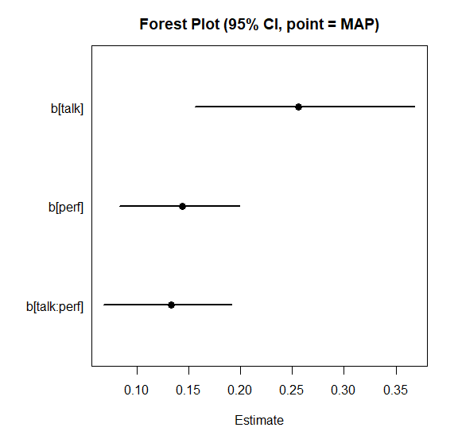

```{r setup, include=FALSE}
knitr::opts_chunk$set(echo = TRUE, eval = FALSE)
```

# このページの目的

このページでは、BayesRTMB を使い始めるための最小限の流れを確認します。

ここで扱うのは、次の内容です。

1. `rtmb_code()` で小さなモデルを書く
2. `rtmb_model()` でモデルオブジェクトを作る
3. `optimize()` と `sample()` で推定する
4. MCMC の事後分布を可視化する
5. ラッパー関数で重回帰と交互作用を扱う
6. `classic()` による頻度主義的な t 検定を行う
7. JZS prior と MCMC によって Bayes factor を計算する

詳しいモデルコードの書き方や、混合モデル、GLMM、モデル比較の詳細は、別の vignette で扱います。

# 0. インストールと環境確認

BayesRTMB は CRAN からインストールできます。

```{r eval=FALSE}
install.packages("BayesRTMB")
```

開発版は GitHub からインストールできます。
`pak` を使う場合は、次のようにします。

```{r eval=FALSE}
install.packages("pak")
pak::pak("norimune/BayesRTMB")
```

`remotes` を使う場合は、次のようにします。

```{r eval=FALSE}
install.packages("remotes")
remotes::install_github("norimune/BayesRTMB")
```

## Windows ユーザー向け

BayesRTMB は内部で RTMB / TMB を利用します。
通常利用では、Windows ユーザーも CRAN のバイナリ版をインストールすれば Rtools は不要です。
Rtools が必要になるのは、ソースからインストールする場合、パッケージ開発を行う場合、または通常の TMB のように独自の C++ テンプレートをコンパイルする場合です。

BayesRTMB をソースからインストールする場合は、Rtools が利用できるかどうかを次のコードで確認できます。

```{r eval=FALSE}
pkgbuild::check_build_tools(debug = TRUE)
```

`TRUE` が返る、またはビルドツールが利用可能であることが表示されれば、ソースインストールの準備はできています。
Rtools が見つからない場合は、利用している R のバージョンに対応する Rtools をインストールし、R または RStudio を再起動してください。

# 1. 最小モデルを書く

まず、もっとも小さな例として二項モデルを書きます。
ここでは、10 回の試行のうち成功が 6 回観測された状況を考えます。

```{r eval=FALSE}
library(BayesRTMB)

Trial <- 10
Y <- 6

dat <- list(Trial = Trial, Y = Y)

code <- rtmb_code(
  parameters = {
    theta <- Dim(lower = 0, upper = 1)
  },
  model = {
    Y ~ binomial(Trial, theta)
    theta ~ beta(1, 1)
  }
)
```

`parameters` ブロックでは推定するパラメータを宣言します。
ここでは成功確率 `theta` を、0 から 1 の範囲を持つパラメータとして定義しています。

`model` ブロックでは、観測データの分布と事前分布を書きます。
`Y ~ binomial(Trial, theta)` は、成功数 `Y` が二項分布に従うことを表しています。

# 2. モデルオブジェクトを作る

`rtmb_model()` にデータとモデルコードを渡すと、推定用のモデルオブジェクトが作られます。

```{r eval=FALSE}
mdl <- rtmb_model(dat, code)
```

```text
## Pre-checking model code...
## Checking RTMB setup...
```

この段階では、まだ推定は行われていません。
`mdl` は、モデル定義とデータを保持した `RTMB_Model` オブジェクトです。

# 3. MAP 推定を行う

点推定をすばやく得たいときは、`optimize()` を使います。
BayesRTMB では、事前分布がある場合は MAP 推定、flat prior の場合は最尤推定に近い推定として扱えます。

```{r eval=FALSE}
fit_map <- mdl$optimize()
fit_map
```

```text
## Starting RTMB optimization...
## 
## 
## Call:
## MAP Estimation via RTMB
## 
## Negative Log-Posterior: 1.38
## Approx. Log Marginal Likelihood (Laplace): -2.33
## 
## Point Estimates and 95% Wald CI:
## variable  Estimate  Std. Error  Lower 95%  Upper 95% 
## theta      0.60000     0.15492    0.29740    0.84166 
```

この例では、成功確率 `theta` の推定値はちょうど 0.60 です。

# 4. MCMC で事後分布を見る

事後分布全体を見たいときは、`sample()` を使います。
クイックスタートでは短い設定にしていますが、実際の分析ではより多くの反復数を使ってください。

```{r eval=FALSE}
set.seed(1)

fit_mcmc <- mdl$sample(
  sampling = 200,
  warmup = 200,
  chains = 2
)

fit_mcmc$summary()
```

```text
## Starting sequential sampling (chains = 2)...
## chain 1 started... 
## chain 1: iter 100 warmup 
## chain 1: iter 200 warmup 
## chain 1: iter 300 sampling 
## chain 1: iter 400 sampling 
## chain 2 started... 
## chain 2: iter 100 warmup 
## chain 2: iter 200 warmup 
## chain 2: iter 300 sampling 
## chain 2: iter 400 sampling 
## variable   mean    sd    map   q2.5  q97.5  ess_bulk  ess_tail  rhat 
## lp        -3.30  0.69  -2.88  -5.25  -2.80       132       188  1.00 
## theta      0.58  0.13   0.60   0.32   0.83       165       177  1.01 
```

MCMC の結果では、平均、標準偏差、事後分位点、ESS、R-hat などを確認できます。
R-hat が 1 に近く、ESS が十分に大きいほど、MCMC の診断としては安心しやすくなります。

## MCMC を並列化する場合

通常の MCMC は追加設定なしで実行できます。
ただし、`sample(parallel = TRUE)` のように MCMC を並列実行する場合は、追加で `future`, `future.apply`, `progressr` が必要です。
`progressr` は、内部で `progressr::progressor()` による進捗表示にも使われます。

```{r eval=FALSE}
install.packages(c("future", "future.apply", "progressr"))
```

これらは BayesRTMB の Suggests パッケージなので、並列化を使わない場合は必須ではありません。

```{r eval=FALSE}
fit_mcmc <- mdl$sample(
  sampling = 1000,
  warmup = 1000,
  chains = 4,
  parallel = TRUE
)
```

# 5. MCMC の結果を可視化する

MCMC の結果は、数値だけでなく図でも確認します。
`draws()` で対象パラメータのサンプルを取り出し、密度、トレース、自己相関、区間推定を確認できます。

```{r eval=FALSE}
theta_draws <- fit_mcmc$draws("theta")

plot_dens(theta_draws)
plot_trace(theta_draws)
plot_acf(theta_draws)
```

それぞれの図は、次の目的で使います。

- `plot_dens()` は、事後分布の形を確認します。
- `plot_trace()` は、チェインがよく混ざっているかを確認します。
- `plot_acf()` は、自己相関が強すぎないかを確認します。

実際には、たとえば次のような図として確認できます。


# 6. ラッパー関数で重回帰を行う

標準的な分析では、`rtmb_code()` を自分で書かずにラッパー関数から始められます。

ここでは、`debate` データを使い、満足度 `sat` を `talk`、`perf`、およびその交互作用で説明する重回帰モデルを推定します。

```{r eval=FALSE}
data(debate)

mdl_lm <- rtmb_lm(
  sat ~ talk * perf,
  data = debate,
  gmc = "all",
  prior = prior_normal()
)

fit_lm <- mdl_lm$optimize(
  se_method = "sampling",
  num_samples = 1000,
  seed = 1
)
fit_lm
```

```text
## Starting RTMB optimization...
## 
## Using simulation-based error propagation (1000 samples)...
## 
## 
## Call:
## MAP Estimation via RTMB
## 
## Negative Log-Posterior: 402.24
## Approx. Log Marginal Likelihood (Laplace): -414.02
## 
## Point Estimates and 95% Sampling-based CI:
##     variable  Estimate  Std. Error  Lower 95%  Upper 95% 
## Intercept_c    3.43325     0.05232    3.33253    3.53604 
## b[talk]        0.26572     0.05305    0.15585    0.36839 
## b[perf]        0.14054     0.02924    0.08274    0.19857 
## b[talk:perf]   0.13022     0.03063    0.06780    0.19111 
## sigma          0.87135     0.03629    0.80181    0.94375 
## Intercept      3.41638     0.05254    3.31562    3.51660 
```

係数を一覧したいときは、`plot_forest()` が便利です。

```{r eval=FALSE}
fit_lm$draws(c("b[talk]", "b[perf]", "b[talk:perf]")) |>
  plot_forest(point_estimate = "MAP")
```



# 7. 交互作用を図で確認する

交互作用は、係数表だけでは解釈しにくいことがあります。
その場合は、`conditional_effects()` を使って予測値を図示します。

```{r eval=FALSE}
ce <- conditional_effects(fit_lm, effect = "talk:perf")
plot(ce)
```


`effect = "talk:perf"` と書くと、`talk` の効果が `perf` の値によってどのように変わるかを確認できます。

より詳しく調べたい場合は、単純傾斜を計算する `simple_effects()` も使えます。

```{r eval=FALSE}
simple_effects(fit_lm, effect = "talk:perf")
```

# 8. t 検定を頻度主義的に行う

BayesRTMB のラッパー関数は、頻度主義的な分析にも使えます。
`prior_flat()` を使った t 検定に対して `classic()` を呼ぶと、通常の t 検定に近い形で結果を表示できます。

```{r eval=FALSE}
mdl_t <- rtmb_ttest(
  sat ~ cond,
  data = debate,
  prior = prior_flat()
)

fit_t_classic <- mdl_t$classic()
fit_t_classic
```

```text
## Pre-checking model code...
## Checking RTMB setup...
## Starting RTMB optimization...
## 
## 
## Call:
## Classical estimation via ttest 
## 
## Log-Likelihood: -421.320, AIC: 848.640, BIC: 842.640
## 
## Point Estimates and Confidence Intervals:
##            Estimate Std. Error Lower 95% Upper 95%  df  t value     Pr
## diff       -0.37333    0.11297  -0.59564  -0.15102 298 -3.30484 .00107  **
## delta      -0.38161    0.11652  -0.61092  -0.15230 298       NA
## total_mean  3.43333    0.05648   3.32218   3.54449 298       NA
## sd          0.97831    0.04007   0.90254   1.06044 298       NA
## mean0       3.24667    0.07988   3.08947   3.40386 298       NA
## mean1       3.62000    0.07988   3.46280   3.77720 298       NA
```

ここでは、`diff` が2群の平均差、`delta` が標準化効果量を表します。
`classic()` は、BayesRTMB のモデルを頻度主義的な推定として確認したいときに使えます。

# 9. JZS prior で Bayes factor を計算する

同じ t 検定でも、JZS prior を使うと、効果量 `delta` に Cauchy 事前分布を置いた Bayes factor を計算できます。

```{r eval=FALSE}
mdl_t_jzs <- rtmb_ttest(
  sat ~ cond,
  data = debate,
  prior = prior_jzs()
)

set.seed(2)

fit_t_jzs <- mdl_t_jzs$sample()

bf <- fit_t_jzs$bayes_factor(fixed = list(delta = 0))
bf
```

```text
## --- Bayes Factor Analysis (Bridge Sampling) ---
## Bayes Factor (BF12) : 21.4323
## Log Bayes Factor    : 3.0649 (Approx. Error = 0.0022)
## Evidence            : Strong evidence for Model 1 
## Comparison model    : Parameters fixed at list(delta = 0) 
```

`fixed = list(delta = 0)` は、効果量を 0 に固定した帰無モデルと比較する指定です。
この例では、`Model 1`、つまり効果量を推定するモデルのほうが支持されています。

実際の分析では、Bayes factor の安定性を確認するために、ここで示した例よりも多い MCMC サンプル数を使うことをおすすめします。

# 次に読むページ

このページでは、BayesRTMB の入口だけを扱いました。
目的に応じて、次のページに進んでください。

1. **[ラッパー関数の使い方](ja-wrapper_functions.html)**  
   回帰、GLM、混合モデル、t 検定、相関、因子分析、IRT など、標準的な分析をラッパー関数で行う方法を確認できます。

2. **[階層モデル・GLMM・分散分析](ja-rtmb_glmer.html)**  
   `rtmb_glmer()` を使った階層モデル、GLMM、残差相関、条件付き効果の可視化を詳しく確認できます。

3. **[モデルコードの書き方](ja-writing_models.html)**  
   `rtmb_code()` の `setup`, `parameters`, `transform`, `model`, `generate` を使って、独自モデルを書く方法を学べます。

4. **[RTMB の仕組みと推定アルゴリズム](ja-rtmb_internals.html)**  
   MAP 推定、Laplace 近似、MCMC、変分推論などの内部処理を確認できます。
