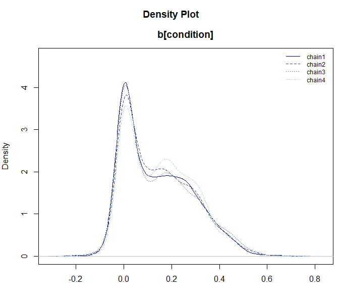

```{r setup, include=FALSE}
knitr::opts_chunk$set(echo = TRUE)
```

BayesRTMB では、`rtmb_code` ブロックを使って自由にモデルを定義できますが、
一般的な統計分析（t検定、回帰分析、因子分析など）を素早く実行するための**ラッパー関数**も用意されています。

これらの関数は、`lm()` や `lme4::glmer()` といった標準的な R の関数に近い文法でモデルを指定でき、
かつ BayesRTMB の強力な推定機能（MCMC、MAP、ADVI）をそのまま利用できます。

このページでは、主要なラッパー関数の使い方を順に紹介します。

---

# 1. rtmb_ttest（ベイズ的t検定）

2 群の平均値の差を検討するための関数です。
BayesRTMB の `rtmb_ttest` は、標準的な t 検定に加えて、**効果量（delta）の推定**と**ベイズファクターの計算**が簡単に行えるよう設計されています。

まず、サンプルデータを生成して分析してみましょう。

```{r eval=FALSE}
library(BayesRTMB)
set.seed(123)

# データの生成（2群）
y1 <- rnorm(30, mean = 0, sd = 1)
y2 <- rnorm(30, mean = 1, sd = 1)

# モデルの作成
mdl_ttest <- rtmb_ttest(y1, y2)

# MCMCによる推定
fit_ttest <- mdl_ttest$sample()
fit_ttest$summary()
```

```text
## variable    mean    sd     map    q2.5   q97.5  ess_bulk  ess_tail  rhat 
## lp        -88.05  1.23  -87.08  -91.16  -86.63      1543      2467  1.00 
## delta       1.24  0.30    1.25    0.65    1.84      1830      1654  1.01 
## mean        0.57  0.12    0.58    0.34    0.81      3058      2436  1.00 
## sd          0.93  0.09    0.92    0.78    1.13      2371      2755  1.00 
## diff        1.15  0.25    1.11    0.64    1.63      2309      1695  1.01 
## mean0      -0.00  0.17   -0.01   -0.34    0.34      2645      2468  1.00 
## mean1       1.14  0.17    1.14    0.80    1.49      2507      2364  1.00 
```

### 生成されたコードの確認

ラッパー関数が内部でどのような `rtmb_code` を生成したかは、モデルオブジェクトの `print_code()` メソッドで確認できます。これにより、ラッパー関数をベースにしつつ、必要に応じて独自のモデルへ拡張する際の参考にできます。

```{r eval=FALSE}
# 内部で生成された RTMB コードを表示
mdl_ttest$print_code()
```

```text
## === RTMB Model Code ===
## 
## rtmb_code(
##   parameters = {
##     mean = Dim(1)
##     sd = Dim(1, lower = 0)
##     delta = Dim(1)
##   }, 
##   transform = {
##     diff <- delta * sd
##     mean0 <- mean - diff/2
##     mean1 <- mean + diff/2
##   }, 
##   model = {
##     Y1 ~ normal(mean0, sd)
##     Y2 ~ normal(mean1, sd)
##     delta ~ cauchy(0, r)
##     mean ~ normal(0, 10)
##     sd ~ exponential(0.1)
##   }, 
##   <environment>
## )
```

### ベイズファクターの計算

`bayes_factor()` メソッドを使うことで、効果量 $\delta = 0$ とする帰無モデルとの比較（ベイズファクター）を算出できます。

```{r eval=FALSE}
# 効果量 delta = 0 のモデルと比較
bf <- fit_ttest$bayes_factor(null_model = "delta")
bf
```

```text
## Bayes Factor (BF12) : 4777.563 
## Log Bayes Factor    : 8.4717 (Approx. Error = 0.0039)
## Interpretation      : Decisive evidence for Model 1 
```

---

# 2. rtmb_lm（線形回帰分析）

標準的な `lm()` と同様のフォーマットで線形回帰を行えます。
ここでは、パッケージに同梱されている `discussion` データ（議論の満足度に関するシミュレーションデータ）を使用します。

```{r eval=FALSE}
data(discussion)

# satisfaction を talk と skill で予測するモデル
mdl_lm <- rtmb_lm(satisfaction ~ talk + skill, data = discussion)

# MAP推定で素早く確認
fit_lm <- mdl_lm$optimize()
fit_lm$summary()
```

```text
## Call:
## MAP Estimation via RTMB
## 
## Negative Log-Posterior: 416.94
## Approx. Log Marginal Likelihood (Laplace): -425.12
## 
## Point Estimates and 95% Wald CI:
##    variable  Estimate  Std. Error  Lower 95%  Upper 95% 
## Intercept     2.14693     0.20761    1.74001    2.55384 
## b[talk]       0.28612     0.05434    0.17961    0.39264 
## b[skill]      0.20106     0.06604    0.07162    0.33050 
## sigma         0.92284     0.03725    0.85265    0.99880 
## Intercept_c   3.43324     0.05333    3.32871    3.53777 
```

### 弱情報事前分布の推奨設定

ベイズファクターの算出（`Bridge Sampling`や`bayes_factor`メソッド）を行う場合、事前分布の設定が結果に影響を与えます。BayesRTMB では、`use_weak_info = TRUE` に設定し、`y_range` に目的変数の理論的な最小値・最大値を指定することで、適切な**弱情報事前分布（Weakly Informative Prior）**を自動構成することを推奨しています。

```{r eval=FALSE}
# 弱情報事前分布を使用してモデルを作成（満足度が 1〜5 の範囲の場合）
mdl_lm_weak <- rtmb_lm(satisfaction ~ talk + skill, 
                       data = discussion, 
                       use_weak_info = TRUE, 
                       y_range = c(1, 5))
mdl_lm_weak$print_code()
```

```text
## === RTMB Model Code ===
## 
## rtmb_code(
##   setup = {
##     N <- length(Y)
##     K <- ncol(X)
##     half_d_y <- diff(y_range)/2
##     base_scale <- half_d_y * weak_info_prior$sd_ratio
##     alpha_prior_sd <- half_d_y
##     mid_y <- mean(y_range)
##     sigma_rate <- 1/base_scale
##     tau_rate <- 1/base_scale
##     X_mean <- apply(X, 2, mean)
##     X_sd <- apply(X, 2, sd)
##     beta_prior_sd <- weak_info_prior$max_beta * base_scale/X_sd
##     X_c <- X - rep(1, N) %*% t(X_mean)
##   }, 
##   parameters = {
##     Intercept_c <- Dim(1)
##     b <- Dim(K)
##     sigma <- Dim(1, lower = 0)
##   }, 
##   transform = {
##     Intercept <- Intercept_c - sum(X_mean * b)
##   }, 
##   model = {
##     # Transform
##     eta <- as.vector(Intercept_c + X_c %*% b)
##     # Likelihood (Data)
##     Y ~ normal(eta, sigma)
##     # Priors
##     sigma ~ exponential(sigma_rate)
##     Intercept_c ~ normal(mid_y, alpha_prior_sd)
##     b ~ normal(0, beta_prior_sd)
##   }
## )
```

---

# 3. rtmb_glm（一般化線形モデル）

`family` 引数を指定することで、ロジスティック回帰やポアソン回帰などを行えます。
例として、実験条件（condition: 0 or 1）を予測するロジスティック回帰を実行します。

```{r eval=FALSE}
# ロジスティック回帰 (family = "bernoulli")
mdl_glm <- rtmb_glm(condition ~ satisfaction + skill, 
                    data = discussion, 
                    family = "bernoulli")

fit_glm <- mdl_glm$sample()
fit_glm$summary()
```

```text
       variable     mean    sd      map     q2.5    q97.5  ess_bulk  ess_tail  rhat 
## lp               -213.72  1.24  -212.80  -216.90  -212.31      1567      2449  1.00 
## Intercept          -1.35  0.50    -1.32    -2.31    -0.38      3740      2794  1.00 
## b[satisfaction]     0.40  0.13     0.38     0.16     0.64      3127      2838  1.00 
## b[skill]           -0.01  0.15     0.01    -0.30     0.28      3445      2925  1.00 
## Intercept_c        -0.00  0.12    -0.03    -0.23     0.23      4129      2544  1.00 
```

### 利用可能な分布（family）

`rtmb_glm` および `rtmb_glmer` では、以下の分布を指定できます。各分布には標準的なリンク関数が内部で設定されています。

| family | リンク関数 | 概要 |
| :--- | :--- | :--- |
| `gaussian` | 恒等 (identity) | 正規分布。標準的な回帰分析に。 |
| `lognormal` | 対数 (log) | 対数正規分布。正の値をとるデータの分析に。 |
| `student_t` | 恒等 (identity) | t 分布。外れ値の影響を抑えたい場合に。 |
| `gamma` | 対数 (log) | ガンマ分布。正の値で歪みのあるデータの分析に。 |
| `bernoulli` | ロジット (logit) | ベルヌーイ分布。0/1 の 2 値データの分析に。 |
| `binomial` | ロジット (logit) | 二項分布。成功回数/試行回数のデータの分析に。 |
| `poisson` | 対数 (log) | ポアソン分布。カウントデータの分析に。 |
| `neg_binomial`| 対数 (log) | 負の二項分布。過分散のあるカウントデータの分析に。 |
| `ordered` | ロジット (logit) | 順序ロジスティック回帰。順序カテゴリカルデータの分析に。 |


---

# 4. rtmb_glmer（一般化線形混合モデル）

`lme4` パッケージのような `(1 | group)` という記法を使って、ランダム効果（変量効果）を含むモデルを扱えます。
個人の満足度が属するグループ（group）によって変動することを考慮したモデルを立ててみます。

```{r eval=FALSE}
# ランダム切片モデル
mdl_glmer <- rtmb_glmer(satisfaction ~ talk + (1 | group), 
                        data = discussion)

# ランダム効果を含む場合は Laplace 近似を有効にした optimize() が高速です
opt_glmer <- mdl_glmer$optimize(laplace = TRUE)
opt_glmer$summary()
```

```text
## Call:
## MAP Estimation via RTMB
## 
## Negative Log-Posterior: 404.65
## Approx. Log Marginal Likelihood (Laplace): -412.59
## Note: Random effects are stored in $random_effects
## 
## Point Estimates and 95% Wald CI:
##    variable  Estimate  Std. Error  Lower 95%  Upper 95% 
## Intercept     2.60450     0.17902    2.25363    2.95537 
## b[talk]       0.27441     0.05477    0.16706    0.38176 
## sigma         0.77389     0.03867    0.70170    0.85351 
## sd[Int]       0.51833     0.06587    0.40406    0.66492 
## Intercept_c   3.43322     0.06846    3.29904    3.56740 
```

## 正則化
`rtmb_lm`, `rtmb_glm`, `rtmb_glmer`では、正則化を使うことができます。正則化は、多すぎるパラメータについて0に縮小させることでより倹約的で予測力の高いモデルを構築することができる方法です。

`BayesRTMB`パッケージでは、`penalty`オプションで馬蹄事前分布を使う`rhs`とspike and slab priorを使う`ssp`が選べます。`rhs`は推定がしやすい反面、効果の小さい係数が完全に0にはなりません。`ssp`は推定がやや重いですが、完全に0に縮小させることができます。

正則化を使うときは、弱情報事前分布を使う必要があるので、目的変数のレンジも入力する必要があります。今回は5件法のデータなので1~5を入力します。正則化のモデルはMAPが難しいことが多いので、MCMCを使うのがよいです。

```{r eval=FALES}
mdl_glmer <-
  rtmb_glmer(
    satisfaction ~ talk + performance + skill + condition + (1 | group),
    data = discussion,
    penalty = "ssp",
    y_range = c(1, 5)
  )

mcmc_glmer <- mdl_glmer$sample(parallel = TRUE)
mcmc_glmer
```

```{r eval=FALSE}
mcmc_glmer$draws("b[condition]") |> plot_dens()
```



---

# 5. rtmb_corr（相関行列の推定）

変数の間の相関関係を推定するための関数です。
ここでは性格五因子（BigFive）のデータの一部を使って、2変数の場合と行列全体の場合を紹介します。

### 2変数の相関とベイズファクター

2つの変数（例：外向性を示す項目 BF1 と BF6）の間の相関を推定し、無相関（$r = 0$）を帰無仮説としたベイズファクターを計算します。

```{r eval=FALSE}
data(BigFive)

# BF1 と BF6 の相関
mdl_corr2 <- rtmb_corr(BigFive[, c("BF1", "BF6")])
mcmc_corr2 <- mdl_corr2$sample()
mcmc_corr2$summary()
```

```text
##  variable     mean    sd      map     q2.5    q97.5  ess_bulk  ess_tail  rhat 
## lp         -493.27  1.55  -492.22  -497.08  -491.16      1799      2658  1.00 
## corr[rho]    -0.60  0.05    -0.60    -0.69    -0.50      2365      2539  1.00 
## mean[BF1]     3.56  0.08     3.56     3.39     3.72      3031      2914  1.00 
## mean[BF6]     2.71  0.09     2.73     2.54     2.89      2978      2872  1.00 
## sd[BF1]       1.10  0.06     1.07     0.99     1.22      3151      3313  1.00 
## sd[BF6]       1.15  0.06     1.16     1.04     1.28      3072      2477  1.00 
```

```{r eval=FALSE}
# 相関 = 0 のモデル（null_model = "corr"）と比較
bf_corr <- mcmc_corr2$bayes_factor(null_model = "corr")
bf_corr
```

```text
Bayes Factor (BF12) : 6.839475e+15 
Log Bayes Factor    : 36.4615 (Approx. Error = 0.0043)
Interpretation      : Decisive evidence for Model 1 
```

### 相関行列の推定

複数の変数を一括して指定すると、相関行列全体を推定します。

```{r eval=FALSE}
# 5つの変数の相関行列を推定
mdl_corr_mat <- rtmb_corr(BigFive[, 1:5])
opt_corr_mat <- mdl_corr_mat$optimize()
opt_corr_mat$summary()
```

```text
## Call:
## MAP Estimation via RTMB
## 
## Negative Log-Posterior: 1254.77
## Approx. Log Marginal Likelihood (Laplace): -1289.58
## 
## Point Estimates and 95% Wald CI:
##      variable  Estimate  Std. Error  Lower 95%  Upper 95% 
## corr[BF1,BF1]   1.00000     0.00000    1.00000    1.00000 
## corr[BF2,BF1]   0.09243     0.07555   -0.05565    0.24050 
## corr[BF3,BF1]   0.09382     0.07552   -0.05420    0.24184 
## corr[BF4,BF1]   0.08807     0.07562   -0.06014    0.23629 
## corr[BF5,BF1]  -0.02158     0.07619   -0.17090    0.12775 
## corr[BF1,BF2]   0.09243     0.07555   -0.05565    0.24050 
## corr[BF2,BF2]   1.00000     0.00000    1.00000    1.00000 
## corr[BF3,BF2]  -0.03374     0.07610   -0.18289    0.11542 
## corr[BF4,BF2]  -0.13588     0.07481   -0.28250    0.01074 
## corr[BF5,BF2]  -0.08526     0.07567   -0.23357    0.06306 
```

---

# 6. rtmb_fa（探索的因子分析）

観測変数の背後にある共通因子を推定します。

## 因子軸の回転

因子分析はMCMCだとやや時間がかかるので、MAP推定が早くて使いやすいです。
`rotate`オプションで、因子の回転が実行できます。
回転後の因子負荷量は`_promax`のように回転名が後ろにつきます。
回転後の因子負荷量はgenerateに入るので、MAPでは標準では標準誤差が計算されません。
`se_sampling =  TRUE`としておくことで標準誤差も計算されます。


```{r eval=FALSE}
# 3因子モデル、プロマックス回転を指定
mdl_fa <- rtmb_fa(BigFive, nfactors = 5, rotate = "promax")

opt_fa <- mdl_fa$optimize(se_sampling = TRUE)
# 因子負荷量 (L) などを確認
opt_fa$summary()
```

```text
## Call:
## MAP Estimation via RTMB
## 
## Negative Log-Posterior: 4791.18
## Approx. Log Marginal Likelihood (Laplace): -5016.21
## 
## Point Estimates and 95% Wald CI:
##         variable  Estimate  Std. Error  Lower 95%  Upper 95% 
## L_promax[BF1,1]    0.86657     0.05905    0.72847    0.95902 
## L_promax[BF2,1]    0.02202     0.05325   -0.07631    0.12786 
## L_promax[BF3,1]   -0.09276     0.06886   -0.20404    0.06562 
## L_promax[BF4,1]    0.04927     0.06391   -0.07333    0.17433 
## L_promax[BF5,1]   -0.02101     0.04856   -0.11742    0.07748 
## L_promax[BF6,1]   -0.80459     0.05957   -0.89651   -0.66314 
## L_promax[BF7,1]   -0.01111     0.05307   -0.11843    0.08566 
## L_promax[BF8,1]   -0.07429     0.05917   -0.16758    0.06246 
## L_promax[BF9,1]   -0.08225     0.07363   -0.23533    0.05242 
## L_promax[BF10,1]   0.03086     0.05210   -0.07256    0.13540 
```

回転後の因子負荷量をソートして表示させる関数、`sort_loadings`を使うと結果が見やすいです。

```{r eval=FALSE}
opt_fa$generate$L_promax |> sort_loadings()
```

```text
##        V1    V2    V3    V4    V5
## V1   .867 -.117 -.179  .089  .057
## V6  -.805  .000  .048  .200 -.065
## V11  .584  .087  .126  .169 -.197
## V16  .516  .087  .276 -.009  .040
## V2   .022 -.806 -.076 -.013  .043
## V7  -.011 -.800 -.175 -.054  .002
## V12  .065 -.797 -.045 -.083 -.088
## V17  .007 -.763  .070  .009 -.012
## V8  -.074  .172  .830 -.044 -.061
## V3  -.093  .044  .533  .101  .060
## V18 -.036 -.196  .512 -.156 -.066
## V13 -.005 -.078  .488 -.121  .154
## V4   .049  .118 -.080  .607  .058
## V14 -.096 -.037 -.031  .586 -.022
## V19  .094  .054  .001  .506 -.085
## V9  -.082  .064 -.059  .463  .019
## V5  -.021 -.132  .021  .206 -.795
## V20 -.022 -.126  .161  .321 -.762
## V15  .000 -.138  .075  .228  .730
## V10  .031 -.120  .047  .317  .712
```

## 因子得点

因子得点も`score = TRUE`のオプションで出力可能です。
因子得点もgenerateに出力されます。

```{r eval=FALSE}
mdl_fa <- rtmb_fa(BigFive, nfactors = 5, rotate = "promax", score = TRUE)

opt_fa <- mdl_fa$optimize()

opt_fa$generate$score |> head()
```

```text
##             [,1]        [,2]        [,3]       [,4]       [,5]
## [1,]  0.49722956 -1.18644757 -1.29011492 -0.1941201 -0.4712234
## [2,] -1.21954058 -0.46063346  1.17665101 -0.8095066  1.0632201
## [3,] -0.05617309  0.09471994 -1.47004442  0.5897946 -0.1808377
## [4,]  0.48324361 -1.40302694  0.04676041 -0.8297736 -0.4993311
## [5,] -0.23744265  1.18767815  0.51330882 -0.3034767 -1.6688545
## [6,]  0.20824541 -0.38166057 -1.12921376  0.8736080 -0.5483280
```

## 正則化因子分析

スパースな負荷量を推定するための Spike-and-Slab Prior（SSP）を用いた正則化因子分析もサポートしています。

正則化は、多すぎるパラメータについて0に縮小させることでより倹約的で予測力の高いモデルを構築することができる方法です。因子分析に適用すると、回転の自由度を消すことができ、一意な解を得ることができます。

正則化因子分析はMAPではうまく推定できないことがあるので、MCMCかADVIを使うほうがいいでしょう。ここではADVI（自動微分変分ベイズ法）による結果を紹介します。

```{r eval=FALSE}
mdl_fa <- rtmb_fa(BigFive, nfactors = 5, rotate = "ssp")

vb_fa <- mdl_fa$variational(iter = 5000, parallel = TRUE)
vb_fa
```

```text
## variable      mean     sd       map      q2.5     q97.5 
## lp        -5362.15  33.02  -5353.45  -5449.35  -5322.61 
## L[BF1,1]     -0.02   0.07     -0.00     -0.22      0.04 
## L[BF2,1]     -0.82   0.04     -0.83     -0.88     -0.74 
## L[BF3,1]      0.00   0.04     -0.00     -0.05      0.05 
## L[BF4,1]      0.02   0.07      0.00     -0.07      0.25 
## L[BF5,1]     -0.02   0.06     -0.00     -0.19      0.05 
## L[BF6,1]      0.00   0.03      0.00     -0.02      0.05 
## L[BF7,1]     -0.82   0.04     -0.82     -0.88     -0.73 
## L[BF8,1]      0.01   0.05      0.00     -0.05      0.11 
## L[BF9,1]      0.01   0.04      0.00     -0.03      0.08 
```

MCMCやADVIの結果の出力は、`EAP`と`MAP`があります。正則化の場合は`MAP`だと厳密に0に近づくので、出力がみやすくなります。

```{r eval=FALSE}
vb_fa$MAP("L") |> sort_loadings()
```

```text
##        V1    V2    V3    V4    V5
## V7  -.823  .000 -.001  .001  .010
## V2  -.820  .001  .000  .000  .001
## V12 -.801 -.001  .000  .001  .000
## V17 -.738  .000  .000  .000  .001
## V1  -.001 -.795 -.001  .000  .001
## V6   .000  .773  .001 -.045  .002
## V11  .004 -.610  .096 -.099 -.021
## V16 -.001 -.554 -.001  .000 -.212
## V15 -.001 -.001 -.822 -.001 -.001
## V10  .000 -.001 -.809  .000  .000
## V5  -.004 -.002  .711 -.339 -.001
## V20  .000 -.001  .668 -.448 -.007
## V4   .002 -.001  .000 -.637  .002
## V19  .001  .000 -.001 -.569  .000
## V14 -.001 -.001 -.001 -.540  .002
## V9   .000  .002  .001 -.429  .002
## V8   .001 -.001  .000  .001 -.854
## V3  -.001 -.001 -.001  .000 -.487
## V13 -.027 -.001 -.003  .000 -.428
## V18 -.220 -.001  .001  .001 -.425
```

---

# 7. rtmb_irt（項目反応理論）

`rtmb_irt()` は、テストデータやアンケートデータの解析に適した項目反応理論（IRT）のモデルを構築します。
現在は以下のモデルをサポートしています。

- **1PL / 2PL / 3PL モデル**: 2値データ（正解/不正解）の分析。
- **Graded Response Model (GRM)**: 多値データ（リッカート尺度など）の分析。

IRTモデルは計算負荷が高いため、大規模なデータでは `variational()` による高速な近似や、
`optimize(laplace = TRUE)` による能力値の周辺化を活用するのが効果的です。

---

# まとめ

BayesRTMB のラッパー関数を使うことで、
- 複雑なモデルコードを書かずに、慣れ親しんだ文法で高度な分析ができる
- 同じモデルオブジェクトから MAP, MCMC, VB を自由に切り替えられる
- ベイズファクターの算出もスムーズに行える
といったメリットが得られます。

よりカスタマイズされたモデルが必要な場合は、[クイックスタート](ja-quick_start.html)を参考に `rtmb_code()` を使ったモデル構築に挑戦してみてください。
