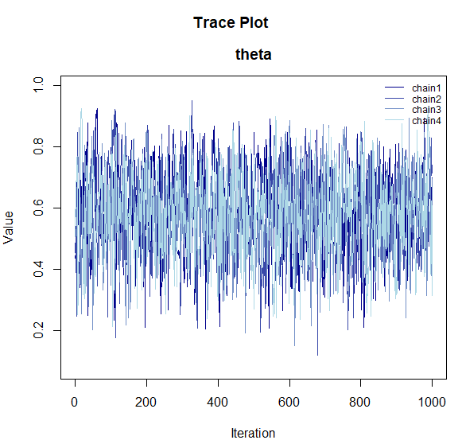
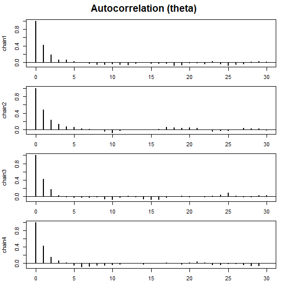
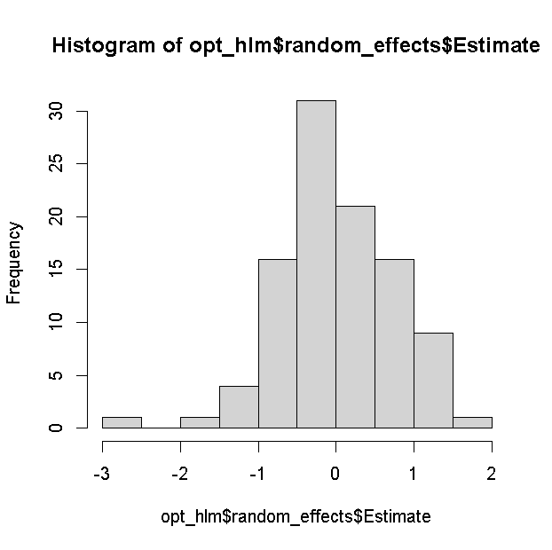
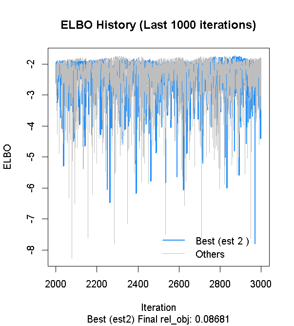

```{r setup, include=FALSE}
knitr::opts_chunk$set(echo = TRUE)
```

This page provides a step-by-step guide on the **fastest route to getting started with BayesRTMB**.

First, we will review the basic flow of `rtmb_code()` and `rtmb_model()` using a simple binomial model. Next, we will see the role of each block in a regression model. Finally, we will learn how to use random effects and the Laplace approximation in a hierarchical model.

# Workflow Covered in this Page

The basic usage of BayesRTMB boils down to three main steps:

1. **Prepare the data**
2. **Write the model using `rtmb_code()`**
3. **Create the model object with `rtmb_model()` and use `optimize()`, `sample()`, or `variational()`**

---

# Binomial Distribution Model

First, we will look at the basic flow of `rtmb_code()` and `rtmb_model()` using the simplest binomial model. Here, we deal with a situation where 6 successes were observed out of 10 trials.

```{r eval=FALSE}
library(BayesRTMB)
Trial <- 10
Y <- 6

data_list <- list(Trial = Trial, Y = Y)

model_code <- rtmb_code(
  parameters={
    theta=Dim(lower=0, upper=1)
  },
  model={
    Y~binomial(Trial,theta)
    theta ~ beta(1, 1)
  }
)
```

## Creating the Model Object

`rtmb_model()` is a function that takes the data and model definition and creates a **model object for estimation**. The minimum required inputs are the `data` summarizing the observations and the `code` created by `rtmb_code()`.

At this stage, estimation has not yet been performed. We will subsequently run `optimize()`, `sample()`, and `variational()` on the created model object.

```{r eval=FALSE}
mdl <- rtmb_model(data = data_list, code = model_code)
```

```text
## Pre-checking model code...
## Checking RTMB setup...
```

## MAP Estimation (Maximum A Posteriori)

`optimize()` performs MAP estimation. This is used when you want to find the **point estimate** corresponding to the mode of the posterior distribution. First, let's run it without additional options and check the output for estimates and interval estimation.

```{r eval=FALSE}
fit_MAP <- mdl$optimize()
fit_MAP
```

```text
## Call:
## MAP Estimation via RTMB
## 
## Negative Log-Posterior: 1.38
## Approx. Log Marginal Likelihood (Laplace): -0.90
## 
## Point Estimates and 95% Wald CI:
## variable  Estimate  Std. Error  Lower 95%  Upper 95% 
## theta      0.59976     0.15495    0.29720    0.84152 
```


### se_sampling option

If you specify `se_sampling = TRUE`, it calculates the **standard errors and 95% intervals via simulation** using the uncertainty of the estimation results. This method allows for accurate 95% confidence intervals even for parameters with minimum or maximum boundaries.

This is useful when you also want to see the confidence intervals for derived quantities.

```{r eval=FALSE}
fit_MAP <- mdl$optimize(se_sampling = TRUE)
fit_MAP
```

```text
## Call:
## MAP Estimation via RTMB
## 
## Negative Log-Posterior: 1.38
## Approx. Log Marginal Likelihood (Laplace): -0.90
## 
## Point Estimates and 95% Wald CI:
## variable  Estimate  Std. Error  Lower 95%  Upper 95% 
## theta      0.59976     0.14563    0.29416    0.83985 
```


### Approximate Log Marginal Likelihood

In MAP estimation, an approximate log marginal likelihood `log_ml` is calculated. This quantity is based on the **Laplace approximation** and serves as a reference for model comparison.

However, caution is needed if the posterior distribution is strongly skewed or multimodal.

```{r eval=FALSE}
fit_MAP$log_ml
```

```text
## [1] -2.328722
```


## MCMC Estimation

`sample()` performs MCMC sampling using NUTS. The default values are `sampling = 1000`, `warmup = 1000`, `chains = 4`, and `thin = 1`.

```{r  eval=FALSE}
fit_mcmc <- mdl$sample(sampling = 1000,
                       warmup   = 1000,
                       chains   = 4,
                       thin     = 1
                       )
```

```{r eval=FALSE}
fit_mcmc
```

```text
## variable   mean    sd    map   q2.5  q97.5  ess_bulk  ess_tail  rhat 
## lp        -3.33  0.74  -2.86  -5.43  -2.80      1712      1744  1.00 
## theta      0.59  0.14   0.62   0.32   0.84      1609      1577  1.00 
```

### Visualizing Inference Results

To check the shape of the posterior distribution obtained via MCMC and its convergence status, BayesRTMB provides several visualization functions.

These functions can be used by passing the samples extracted with the `$draws()` method from the model object.

```{r eval = FALSE}
# Extract posterior samples
samples <- fit_mcmc$draws("theta")

# Posterior density plot
plot_dens(samples)

# Trace plot (checking convergence)
plot_trace(samples)

# Autocorrelation plot
plot_acf(samples)

# Forest plot (overview of point estimates and intervals)
plot_forest(samples)
```






- **`plot_dens()`**: Displays the posterior distribution density for each parameter.
- **`plot_trace()`**: Shows how each chain moved through the parameter space. If the chains are overlapping (resembling a "caterpillar"), convergence is likely.
- **`plot_acf()`**: Plots the autocorrelation of the MCMC samples.
- **`plot_forest()`**: Displays the point estimates (median) and 95% credible intervals for the parameters side-by-side.

### Computing Log Marginal Likelihood via bridgesampling

By using `bridgesampling()`, you can estimate the **log marginal likelihood** based on the MCMC samples. The output also includes an estimation error, so if the error is large, you can increase the number of samples to improve accuracy.

Once calculated, the result is saved in `fit_mcmc$log_ml`, allowing it to be reused later on the same object.

```{r eval=FALSE}
fit_mcmc$bridgesampling()

fit_mcmc$log_ml
```

```text
## [1] -2.401682
## attr(,"error")
## [1] 0.001049984
## attr(,"ess")
## [1] 1204.976
```


# Regression Model

Next, let's look at the role of each block in `rtmb_code()` using a regression analysis as an example. In this example, the flow is as follows:

- `setup`: Organize data dimensions.
- `parameters`: Declare the parameters to be estimated.
- `transform`: Define the mean structure `mu`.
- `model`: Write the likelihood and prior distributions.

Note that for standard analyses such as regression or generalized linear (mixed) models, you can use wrapper functions like `rtmb_lm` or `rtmb_glmer` to automatically generate and estimate models without writing code yourself. For details, see [Wrapper Functions](wrapper_functions.html).

Here, we will build a model that assigns normal distributions to the intercept and regression coefficients, and an exponential distribution to the residual standard deviation as priors. We will use the discussion data included in this package. This data contains the satisfaction of a discussion as the objective variable, and features like the amount of talk, discussion performance, conversation skills, and condition (discussion goal). Here, we will use the amount of talk, performance, and conversation skills.

```{r eval=FALSE}
data(discussion)

Y <- discussion$satisfaction
X_names <- c("talk","performance","skill")
X <- subset(discussion, select = X_names)

data_reg <- list(Y = Y, X = X)

code_reg <- rtmb_code(
  setup = {
    N <- length(Y)
    P <- ncol(X)
  },
  parameters = {
    alpha   = Dim()
    beta    = Dim(P)
    sigma   = Dim(lower=0)
  },
  transform = {
    mu = alpha + beta[1] * X[,1] + beta[2] * X[,2] + beta[3] * X[,3]
  },
  model = {
    Y ~ normal(mu, sigma)
    alpha ~ normal(0, 100)
    beta  ~ normal(0, 10)
    sigma ~ exponential(1/10)
  }
)
```

## Adding Initial Values to the Model

In `rtmb_model()`, you can provide initial values by specifying `init`. Setting explicit initial values can often help stabilize estimation in complex models. If you specify only some parameters, the rest can be automatically filled in.

```{r eval=FALSE}
mdl_reg <- rtmb_model(data = data_reg, 
                      code = code_reg,
                      init = list(alpha = 0, beta = c(0,0,0)))
```


## MCMC Estimation

For regression models as well, you can evaluate the entire posterior distribution using `sample()`.

```{r  eval=FALSE}
mcmc_reg <- mdl_reg$sample()
mcmc_reg
```

```text
## variable     mean    sd      map     q2.5    q97.5  ess_bulk  ess_tail  rhat 
## lp        -411.42  1.70  -410.51  -415.77  -409.27      1099      1125  1.00 
## alpha        1.51  0.24     1.52     1.03     1.98       805       842  1.01 
## beta[1]      0.27  0.05     0.26     0.17     0.37       765      1223  1.00 
## beta[2]      0.15  0.03     0.15     0.09     0.21       958      1107  1.01 
## beta[3]      0.19  0.07     0.18     0.06     0.33      1004      1156  1.00 
## sigma        0.90  0.04     0.90     0.83     0.98       984      1196  1.00 
## mu[1]        2.96  0.10     2.96     2.76     3.16      1070      1095  1.00 
## mu[2]        3.08  0.11     3.07     2.86     3.30      1254      2031  1.00 
## mu[3]        2.96  0.10     2.96     2.76     3.16      1070      1095  1.00 
## mu[4]        3.35  0.10     3.34     3.16     3.54      1489      2198  1.00 
```


### bayes_factor

By using `bayes_factor()`, you can compare the marginal likelihood of the estimated model with a null model, calculating the **Bayes factor**. For example, specifying `null_model = "beta[1]"` internally creates and compares against a null model where that coefficient is fixed at 0.

This is useful when you want to evaluate the presence or absence of an effect using a Bayesian approach.

```{r  eval=FALSE}
bf_result <- mcmc_reg$bayes_factor(null_model = "beta[1]")
bf_result
```

```text
## Bayes Factor (BF12) : 1047.097 
## Log Bayes Factor    : 6.9538 (Approx. Error = 0.0051)
## Interpretation      : Decisive evidence for Model 1 
```


---

# Hierarchical Linear Model

We will again use the `discussion` data for our hierarchical model example. Here, we introduce random effects for each group to represent individual differences.

In hierarchical models, centering explanatory variables and providing appropriate initial values can often be effective in improving the stability of the estimation.

```{r eval=FALSE}
data(discussion)

Y <- discussion$satisfaction
X_names <- c("talk","performance","skill")
X <- subset(discussion, select = X_names)
group <- discussion$group

data_hlm <- list(Y = Y, X = X, group = group)

code_hlm <- rtmb_code(
  setup = {
    N <- length(Y)
    G <- length(unique(group))
    P <- ncol(X)
  },
  parameters = {
    alpha   = Dim()
    beta    = Dim(P)
    tau     = Dim(lower=0)
    sigma   = Dim(lower=0)
    r       = Dim(G, random = TRUE)
  },
  transform = {
    mu = alpha + X %*% beta + r[group] * tau
  },
  model = {
    Y ~ normal(mu, sigma)
    r ~ normal(0, 1)
    alpha ~ normal(0, 100)
    beta  ~ normal(0, 10)
    tau   ~ exponential(1/10)
    sigma ~ exponential(1/10)
  }
)
```

## Model Setup

Specifying `par_names` and `view` when creating the model makes the summary output easier to read. `par_names` is used to assign display names to parameters, and `view` is used to specify which variables should be prioritized for display at the top in outputs like `summary()`.

In this example, we use `par_names` to name the regression coefficients and `view` to ensure `tau` is displayed above `sigma`. Setting these two options in advance is convenient for improving output readability.

```{r eval=FALSE}
mdl_hlm <-
  rtmb_model(
    data = data_hlm,
    code = code_hlm,
    par_names = list(beta = X_names),
    view = c("alpha", "beta", "tau", "sigma")
  )
```

## MAP Estimation via Laplace Approximation

By setting `optimize(laplace = TRUE)` (which is the default), you can estimate the fixed effects while marginalizing (integrating out) the random effects using the **Laplace approximation**. This often significantly reduces computation time in hierarchical models and is useful for quickly grasping the overall picture via MAP first.

```{r eval=FALSE}
opt_hlm <- mdl_hlm$optimize(laplace = TRUE)
opt_hlm
```

```text
## Call:
## MAP Estimation via RTMB
## 
## Negative Log-Posterior: 399.48
## Approx. Log Marginal Likelihood (Laplace): -411.83
## Note: Random effects are stored in $random_effects
## 
## Point Estimates and 95% Wald CI:
##          variable  Estimate  Std. Error  Lower 95%  Upper 95% 
## alpha               1.52450     0.25732    1.02015    2.02884 
## beta[talk]          0.23487     0.05323    0.13054    0.33920 
## beta[performance]   0.15451     0.03713    0.08175    0.22728 
## beta[skill]         0.22613     0.05990    0.10874    0.34352 
## tau                 0.48512     0.06507    0.37298    0.63098 
## sigma               0.74762     0.03752    0.67759    0.82488 
## mu[1,1]             2.92366     0.34519    2.24711    3.60022 
## mu[2,1]             3.14105     0.34856    2.45788    3.82422 
## mu[3,1]             2.92366     0.34519    2.24711    3.60022 
## mu[4,1]             3.09284     0.34706    2.41263    3.77306 
```

Despite differences in priors, the Laplace approximation results are almost identical to maximum likelihood estimation using `lme4`.

```{r eval = FALSE}
library(lme4)
result <- 
  lmer(satisfaction ~ talk + performance + skill + (1|group), 
       data = discussion, REML = FALSE)

result |> summary()
```

```text
## Linear mixed model fit by maximum likelihood  ['lmerMod']
## Formula: satisfaction ~ talk + performance + skill + (1 | group)
##    Data: discussion
## 
##       AIC       BIC    logLik -2*log(L)  df.resid 
##     771.1     793.4    -379.6     759.1       294 
## 
## Scaled residuals: 
##      Min       1Q   Median       3Q      Max 
## -3.15138 -0.51022  0.03797  0.54144  2.87725 
## 
## Random effects:
##  Groups   Name        Variance Std.Dev.
##  group    (Intercept) 0.2357   0.4855  
##  Residual             0.5601   0.7484  
## Number of obs: 300, groups:  group, 100
## 
## Fixed effects:
##             Estimate Std. Error t value
## (Intercept)  1.52449    0.25735   5.924
## talk         0.23485    0.05286   4.443
## performance  0.15451    0.03714   4.160
## skill        0.22616    0.05960   3.795
## 
## Correlation of Fixed Effects:
##             (Intr) talk   prfrmn
## talk        -0.516              
## performance -0.632 -0.056       
## skill       -0.387 -0.138 -0.020
```

The estimation results for the random effects are saved separately in `random_effects`.
```{r eval=FALSE}
opt_hlm$random_effects$Estimate |> hist()
```



## MCMC

Hierarchical models can also be estimated stably with MCMC via `sample()`. If there are many chains or the model is heavy, you can specify `parallel = TRUE` for parallel processing. The first time you run parallel processing, setting up the workers takes some time, but subsequent runs will launch faster (it is set to `FALSE` by default).

You can increase `warmup` and `sampling` as needed while checking convergence diagnostics.

```{r  eval=FALSE}
mcmc_hlm <- mdl_hlm$sample(parallel = TRUE)
mcmc_hlm$summary()
```

```text
##          variable     mean     sd      map     q2.5    q97.5  ess_bulk  ess_tail  rhat 
## lp                 -503.48  11.43  -502.73  -527.43  -482.45       845      1883  1.00 
## alpha                 1.53   0.26     1.50     1.02     2.04      1885      2572  1.00 
## beta[talk]            0.24   0.06     0.23     0.13     0.34      3292      3346  1.00 
## beta[performance]     0.15   0.04     0.16     0.08     0.23      1724      2415  1.00 
## beta[skill]           0.23   0.06     0.21     0.10     0.34      4128      3016  1.00 
## tau                   0.50   0.07     0.50     0.36     0.63      1532      1885  1.00 
## sigma                 0.76   0.04     0.76     0.69     0.84      2123      3211  1.00 
## r[1]                  0.02   0.66     0.00    -1.28     1.27      6016      2961  1.00 
## r[2]                 -0.56   0.66    -0.47    -1.86     0.73      5403      2966  1.00 
## r[3]                 -0.75   0.68    -0.77    -2.07     0.58      5041      3202  1.00 
```

You can also run the Laplace approximation with MCMC. Although the estimation results do not change, it tends to reduce MCMC autocorrelation, making convergence more stable. However, the computation time increases, so it's a trade-off. If MCMC converges sufficiently well, you might not need to explicitly use the Laplace approximation.
However, it is sometimes convenient to do it automatically since comparing models with and without hierarchies using predictive metrics like WAIC can be difficult.

```{r eval=FALSE}
mcmc_hlm_l <- mdl_hlm$sample(laplace = TRUE, parallel = TRUE)
```


## ADVI

For complex hierarchical models, MAP might fail to find a solution, and MCMC might take too long. Variational Bayes is useful when you want to obtain an approximate solution in such cases. Variational Bayes can also be parallelized.
However, for complex models, judging convergence can be difficult, so it's important to check if it has converged using the `plot_elbo()` method. Since Variational Bayes is sensitive to initial values, providing rough initial values stabilizes convergence.

You can also use the Laplace approximation in ADVI, though it slows down the computation.
`method = "meanfield"` assumes that the posterior distribution components are all independent. Although the credible intervals are estimated somewhat narrowly, it is perfectly adequate for obtaining point estimates.

```{r eval=FALSE}
vb_hlm <- mdl_hlm$variational(
  iter = 7000,
  parallel = TRUE,
  method = "meanfield",
  laplace = TRUE
)

vb_hlm$summary(digits=5)
```

```text
##          variable        mean       sd         map        q2.5       q97.5 
## lp                 -403.59863  2.68487  -401.72373  -410.58114  -400.88726 
## alpha                 1.52112  0.06460     1.52966     1.39289     1.65062 
## beta[talk]            0.23008  0.02011     0.22903     0.18939     0.26960 
## beta[performance]     0.15445  0.01236     0.15815     0.12902     0.17917 
## beta[skill]           0.22121  0.02962     0.23026     0.16046     0.27926 
## tau                   0.52022  0.06577     0.50972     0.40743     0.65876 
## sigma                 0.76221  0.03666     0.75816     0.69228     0.83982 
## mu[1,1]               2.91530  0.04257     2.91892     2.83138     3.00157 
## mu[2,1]               3.12764  0.06905     3.15095     2.99470     3.26365 
## mu[3,1]               2.91530  0.04257     2.91892     2.83138     3.00157 
```

Furthermore, if you set the method to `fullrank`, you can estimate assuming a multivariate normal distribution where the posterior distribution is not independent. Theoretically, specifying `laplace=TRUE` and `method = "fullrank"` should yield results similar to MAP.

```{r eval = FALSE}
vb_hlm <- mdl_hlm$variational(
  iter = 7000,
  parallel = TRUE,
  method = "fullrank",
  laplace = TRUE
)

vb_hlm$summary(digits=5)
```

```text
##          variable        mean       sd         map        q2.5       q97.5 
## lp                 -403.97866  2.20926  -402.90991  -409.23611  -401.18538 
## alpha                 1.53770  0.25051     1.56744     1.01054     2.02055 
## beta[talk]            0.24155  0.05547     0.23247     0.13522     0.35168 
## beta[performance]     0.15541  0.03070     0.14594     0.09867     0.21363 
## beta[skill]           0.22281  0.06458     0.24644     0.09070     0.34811 
## tau                   0.51825  0.07037     0.52741     0.39687     0.66168 
## sigma                 0.75946  0.05066     0.76286     0.66550     0.85404 
## mu[1,1]               2.94047  0.07042     2.92289     2.80572     3.08573 
## mu[2,1]               3.14453  0.09346     3.14312     2.96019     3.32846 
## mu[3,1]               2.94047  0.07042     2.92289     2.80572     3.08573 
```

If some estimation results converge poorly, you can look only at the best ones. As long as the estimated ELBOs from the last 1000 iterations align horizontally in a random manner, it's fine. If it's sloping upwards, it might not have converged yet.

```{r eval=FALSE}
vb_hlm$plot_elbo(ests="best")

vb_hlm$summary()
```



## Model Comparison

Model comparison can be performed by calculating the log marginal likelihood.

Let's compare the results of the regression analysis earlier with the hierarchical linear model. How much did the model improve by estimating the random effects?

Since MAP estimation can also calculate log marginal likelihoods, approximate model comparisons can be made.

```{r eval = FALSE}
opt_reg <- mdl_reg$optimize()
opt_reg$log_ml
opt_hlm$log_ml
```

```text
## > opt_reg$log_ml
## [1] -419.6358
## > opt_hlm$log_ml
## [1] -411.8348
```

However, since the log marginal likelihood in MAP estimation is strictly an approximation, it is better to calculate it using `bridgesampling` on the MCMC estimation results for more accuracy. In particular, because MAP uses the Laplace approximation when there are random effects, its log marginal likelihood will differ slightly from MCMC without Laplace approximation.

```{r eval = FALSE}
mcmc_reg$bridgesampling()
mcmc_hlm$bridgesampling()
```

```text
## > mcmc_reg$bridgesampling()
## Bridge Sampling Converged: LogML = -419.608 (Error = 0.0039, ESS = 830.6)
## [1] -419.6081
## attr(,"error")
## [1] 0.003854939
## attr(,"ess")
## [1] 830.623
## > mcmc_hlm$bridgesampling()
## Bridge Sampling Converged: LogML = -412.675 (Error = 0.0401, ESS = 760.2)
## [1] -412.6746
## attr(,"error")
## [1] 0.04009978
## attr(,"ess")
## [1] 760.1723
```

MCMC with the Laplace approximation yields results closer to MAP.

```{r eval = FALSE}
mcmc_hlm_l$bridgesampling()
```

```text
## > mcmc_hlm_l$bridgesampling()
## Bridge Sampling Converged: LogML = -411.770 (Error = 0.0053, ESS = 994.9)
## [1] -411.7704
## attr(,"error")
## [1] 0.005318097
## attr(,"ess")
## [1] 994.8858
```

# GLMM

Generalized Linear Mixed Models (GLMMs) are also possible.

Since discussion satisfaction is measured on a 5-point scale, it can be treated as ordinal data. Therefore, let's run a multilevel analysis assuming an ordered logistic distribution.

```{r eval=FALSE}
data(discussion)

Y <- discussion$satisfaction
X_names <- c("talk","performance","skill")
X <- subset(discussion, select = X_names)
group <- discussion$group

data_glmm <- list(Y = Y, X = X, group = group)

code_glmm <- rtmb_code(
  setup = {
    N <- length(Y)
    G <- length(unique(group))
    P <- ncol(X)
    K <- length(unique(Y))
  },
  parameters = {
    alpha   = Dim(K-1, type = "ordered") # Ordered constrained vector
    beta    = Dim(P)
    tau     = Dim(lower=0)
    r       = Dim(G, random = TRUE)
  },
  transform = {
    mu = X %*% beta + r[group] * tau
  },
  model = {
    Y ~ ordered_logistic(mu, alpha) # Ordered logistic is available
    r ~ normal(0, 1)
    alpha ~ normal(0, 2.5)
    beta  ~ normal(0, 10)
    tau   ~ exponential(1/10)
  }
)
```


## Loading the Model
```{r eval=FALSE}
mdl_glmm <- rtmb_model(data_glmm, code_glmm,
                       par_names = list(beta = X_names))
```

## GLMM via Laplace Approximation
Even for GLMMs, MAP estimation is possible by integrating out the random effects.

```{r eval=FALSE}
opt_glmm <- mdl_glmm$optimize()
opt_glmm
```

```text
## Call:
## MAP Estimation via RTMB
## 
## Negative Log-Posterior: 391.24
## Approx. Log Marginal Likelihood (Laplace): -397.74
## Note: Random effects are stored in $random_effects
## 
## Point Estimates and 95% Wald CI:
##          variable  Estimate  Std. Error  Lower 95%  Upper 95% 
## alpha[1]           -0.30770     0.65457   -1.59063    0.97522 
## alpha[2]            1.48733     0.60548   -0.32034    3.51175 
## alpha[3]            4.25193     0.63446    1.98068    6.83335 
## alpha[4]            6.50517     0.70195    3.81621    9.59934 
## beta[talk]          0.50442     0.13449    0.24082    0.76802 
## beta[performance]   0.32810     0.09502    0.14186    0.51434 
## beta[skill]         0.49771     0.15633    0.19131    0.80411 
## tau                 1.27056     0.21778    0.90803    1.77784 
## mu[1,1]             2.81917     0.93273    0.99105    4.64730 
## mu[2,1]             3.31017     0.97502    1.39917    5.22117 
```

# Mixture Distribution Model

You can also estimate data that is a mixture of multiple distributions. First, let's generate the data.

```{r eval = FALSE}
set.seed(123)

N <- 300       # Sample size
K <- 3         # Number of clusters

# True parameters
theta_true <- c(0.2, 0.5, 0.3) # Mixing ratio for each cluster (sum to 1)
mu_true    <- c(-3, 0, 4)      # Mean of each cluster
sigma_true <- c(0.5, 1.0, 0.8) # Standard deviation of each cluster

# Latent variable z (which cluster each data point comes from)
z <- sample(1:K, size = N, replace = TRUE, prob = theta_true)

# Observed data Y
Y <- numeric(N)
for (i in 1:N) {
  Y[i] <- rnorm(1, mean = mu_true[z[i]], sd = sigma_true[z[i]])
}

Y |> hist()

data_mix <- list(Y = Y)
```

Here is the code.
```{r eval = FALSE}
code_mix <- rtmb_code(
  setup = {
    K = 3 # Number of clusters
  },
  parameters = {
    theta = Dim(K,type="simplex") # Positive vector summing to 1, common in mixing ratios
    mu    = Dim(K)
    sigma = Dim(K, lower = 0) 
  },
  model = {
    mu ~ normal(0, 5)
    sigma ~ exponential(1)
    theta ~ dirichlet(rep(1, K)) # Dirichlet distribution as prior
    Y ~ normal_mixture(theta, mu, sigma) # Built-in normal mixture distribution
  }
)
```

## Model Preparation
```{r eval = FALSE}
mdl_mix <- rtmb_model(data_mix, code_mix)
```

## Setting Initial Values

Mixture distribution models often suffer from label switching if estimated directly. Label switching is a phenomenon where the cluster labeling changes across chains. While inevitable in MCMC, providing initial values makes it less likely to occur.

Therefore, we use MAP estimates. However, since mixture models are highly dependent on initial values and often fall into local optima, we run multiple MAP estimations. Setting `num_estimate = 8` runs it 8 times.

```{r eval = FALSE}
opt_mix <- mdl_mix$optimize(num_estimate = 8)
```

```text
## Starting optimization...
## Optimization run 8/8...
## 
## Optimization Diagnostics per estimate:
##   est1: Objective =     711.49, Code = 0 (Converged)
##   est2: Objective =     711.49, Code = 0 (Converged)
##   est3: Objective =     655.84, Code = 0 (Converged)  <-- BEST
##   est4: Objective =     695.90, Code = 0 (Converged)
##   est5: Objective =     655.84, Code = 0 (Converged)
##   est6: Objective =     675.00, Code = 0 (Converged)
##   est7: Objective =     713.57, Code = 0 (Converged)
##   est8: Objective =     676.45, Code = 0 (Converged)
```

We run MCMC using this "Best" result as the initial value.

```{r eval = FALSE}
mcmc_mix <- mdl_mix$sample(parallel=TRUE, init = opt_mix$par)
mcmc_mix
```

```text
## variable     mean    sd      map     q2.5    q97.5  ess_bulk  ess_tail  rhat 
## lp        -664.57  2.05  -663.46  -669.30  -661.57      1717      2894  1.00 
## theta[1]     0.29  0.03     0.29     0.24     0.35      3928      2829  1.00 
## theta[2]     0.18  0.03     0.18     0.13     0.23      3274      2909  1.00 
## theta[3]     0.53  0.04     0.53     0.46     0.60      2790      2986  1.00 
## mu[1]        3.93  0.10     3.94     3.72     4.13      3551      2683  1.00 
## mu[2]       -2.98  0.09    -2.97    -3.15    -2.80      3210      3099  1.00 
## mu[3]        0.03  0.11     0.02    -0.19     0.23      3506      3255  1.00 
## sigma[1]     0.77  0.08     0.74     0.62     0.96      2724      2573  1.00 
## sigma[2]     0.51  0.07     0.49     0.39     0.67      3459      3004  1.00 
## sigma[3]     1.07  0.12     1.04     0.87     1.33      2758      2518  1.00  
```

# Summary

In this page, we learned the basic workflow of BayesRTMB through three types of models.

- **Simple Models**: Understand the minimal setup using `rtmb_code()` and `rtmb_model()`.
- **Regression Models**: Understand the roles of `setup`, `parameters`, `transform`, and `model`.
- **Hierarchical Models**: Understand the usage of random effects and Laplace approximation.

It is generally easier to first confirm the model's behavior using MAP estimation, and then try MCMC or ADVI. For more details, viewing the [Introduction](introduction.html) along with the References will help you grasp the overall picture.
